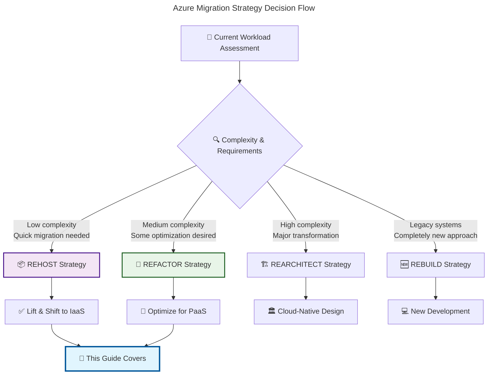
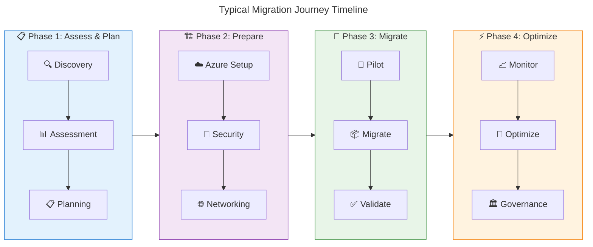

# 🎯 Migration Strategy Overview

**Understanding the journey from on-premises to Azure cloud**

---

## 📊 What is Cloud Migration?

Cloud migration is the process of moving digital business operations from **on-premises infrastructure** to **cloud platforms**. Think of it as moving from owning your own office building to renting modern, flexible workspace that scales with your needs.

### 🏗️ Migration Strategy Landscape

According to the Microsoft Cloud Adoption Framework, there are several migration strategies. This guide focuses on the two most common:

## 🎯 Focus: Rehost vs Refactor

### 📦 **Rehost (Lift & Shift)**
> *"Moving your applications to the cloud with minimal changes"*

**What it means in simple terms:**
- Like moving your furniture to a new house without changing the furniture itself
- Applications run on Azure virtual machines instead of on-premises servers
- **Fastest** path to cloud adoption
- **Minimal code changes** required

**Best for:**
- ✅ Legacy applications that work well as-is
- ✅ Tight migration timelines
- ✅ Limited cloud expertise initially
- ✅ Regulatory requirements for infrastructure control

### 🔄 **Refactor (Replatform)**
> *"Optimizing applications to take advantage of cloud capabilities"*

**What it means in simple terms:**
- Like renovating your house to make it more energy-efficient and modern
- Applications are modified to use **cloud-native services**
- **Better performance and cost optimization**
- Some code changes required

**Best for:**
- ✅ Applications that can benefit from managed services
- ✅ Cost optimization priorities
- ✅ Performance improvement goals
- ✅ Teams with cloud development skills

## 📈 Migration Strategy Comparison

| Aspect | 📦 Rehost | 🔄 Refactor |
|--------|-----------|-------------|
| **⏱️ Time to Migrate** | 🟢 Fast (weeks) | 🟡 Moderate (months) |
| **💰 Initial Cost** | 🟢 Lower | 🟡 Higher |
| **🛠️ Complexity** | 🟢 Low | 🟡 Medium |
| **📊 Long-term Benefits** | 🟡 Limited | 🟢 High |
| **⚡ Performance Gains** | 🟡 Minimal | 🟢 Significant |
| **🔧 Maintenance** | 🔴 Higher | 🟢 Lower |
| **📈 Scalability** | 🟡 Manual | 🟢 Automatic |

## 🗺️ Migration Journey Phases

## 🎯 Key Success Factors

### 🔍 **Assessment is Critical**
- **Inventory all applications** and dependencies
- **Identify migration blockers** early
- **Estimate costs** for both strategies
- **Plan for downtime** and user impact

### 👥 **Team Readiness**
- **Train teams** on Azure fundamentals
- **Establish clear roles** and responsibilities
- **Create communication plans** for stakeholders
- **Set up support processes** for post-migration

### 🛡️ **Risk Management**
- **Test thoroughly** in non-production environments
- **Plan rollback strategies** for each workload
- **Monitor performance** before, during, and after migration
- **Document lessons learned** for future migrations

## 📚 Framework Alignment

### 🏛️ **Cloud Adoption Framework (CAF)**
This guide aligns with CAF's **Adopt methodology**:
- ✅ **Strategy**: Business justification and expected outcomes
- ✅ **Plan**: Migration approach and timeline
- ✅ **Ready**: Landing zone and Azure setup
- ✅ **Adopt**: Migration execution (this guide's focus)

### 🏗️ **Well-Architected Framework (WAF)**
Every migration recommendation considers WAF pillars:
- 🛡️ **Security**: Identity, encryption, network protection
- 🔄 **Reliability**: Backup, disaster recovery, resilience
- ⚡ **Performance**: Scalability, monitoring, optimization
- 💰 **Cost**: Resource optimization, reserved instances
- 🎯 **Operational Excellence**: Automation, governance, monitoring

---

## 🎯 Key Takeaways

- **🎯 Choose the right strategy** based on your timeline, complexity, and goals
- **📦 Rehost** is fastest but may limit long-term cloud benefits
- **🔄 Refactor** requires more effort but delivers better cloud-native advantages
- **📋 Assessment and planning** are critical for success regardless of strategy
- **🏛️ Framework alignment** ensures best practices and long-term success

---

**📖 Next Steps:**
- 🔗 [Strategy Selection Guide](../01-getting-started/strategy-selection.md) - Detailed decision framework
- 📦 [Rehost Implementation](../02-rehost/overview.md) - Lift & shift approach
- 🔄 [Refactor Implementation](../03-refactor/overview.md) - Cloud optimization approach
