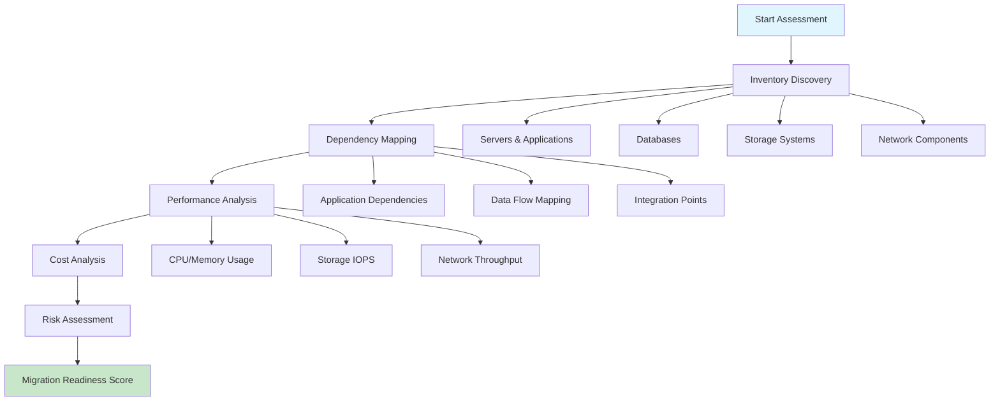
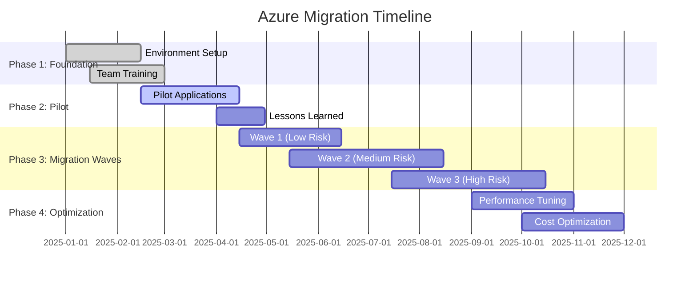

# 📋 Prerequisites & Planning

**Essential preparation steps for Azure migration success**

---

## 🎯 Overview

Proper planning is critical for successful Azure migration. This guide covers prerequisites, assessment activities, and planning considerations for both Rehost and Refactor strategies.

## ✅ Prerequisites Checklist

### 🏢 Organizational Readiness

- [ ] **Executive Sponsorship**: Secure leadership buy-in and budget approval
- [ ] **Migration Team**: Assemble cross-functional team with defined roles
- [ ] **Training Plan**: Ensure team has Azure knowledge and certifications
- [ ] **Change Management**: Establish communication and change processes

### 🔐 Azure Environment Setup

- [ ] **Azure Subscription**: Active subscription with appropriate service limits
- [ ] **Identity Management**: Azure AD/Entra ID configuration
- [ ] **Networking**: ExpressRoute or VPN connectivity established
- [ ] **Governance**: Resource groups, tagging strategy, and policies defined

### 🛡️ Security & Compliance

- [ ] **Security Baseline**: Define security requirements and controls
- [ ] **Compliance Requirements**: Identify regulatory and industry standards
- [ ] **Data Classification**: Classify data sensitivity and residency requirements
- [ ] **Backup Strategy**: Define backup and disaster recovery requirements

### 💰 Financial Planning

- [ ] **Cost Modeling**: Estimate migration and operational costs
- [ ] **Budget Approval**: Secure funding for migration project
- [ ] **Cost Management**: Implement cost monitoring and optimization
- [ ] **Business Case**: Document expected ROI and benefits

## 🔍 Workload Assessment

### 📊 Discovery Phase



### 🔧 Assessment Tools

| **Tool** | **Purpose** | **Use Case** |
|----------|-------------|--------------|
| 🔍 **Azure Migrate** | Comprehensive discovery | All workload types |
| 📊 **Azure TCO Calculator** | Cost estimation | Financial planning |
| 🛡️ **Azure Security Center** | Security assessment | Security baseline |
| ⚡ **Azure Advisor** | Optimization recommendations | Best practices |
| 📈 **Azure Monitor** | Performance insights | Current state analysis |

### 📋 Assessment Criteria

#### **Technical Assessment**
- **Compatibility**: Azure service compatibility
- **Dependencies**: Application and data dependencies
- **Performance**: Resource utilization patterns
- **Integration**: External system integrations

#### **Business Assessment**
- **Criticality**: Business impact and priority
- **Compliance**: Regulatory requirements
- **Timeline**: Migration window constraints
- **Resources**: Available team capacity

## 🎯 Migration Strategy Selection

### 📊 Decision Matrix

| **Criteria** | **Weight** | **Rehost Score** | **Refactor Score** |
|--------------|------------|------------------|-------------------|
| 🕒 **Time to Market** | 30% | 9/10 | 5/10 |
| 💰 **Initial Cost** | 25% | 8/10 | 4/10 |
| 🔮 **Long-term Value** | 20% | 5/10 | 9/10 |
| 🛡️ **Risk Level** | 15% | 8/10 | 6/10 |
| 🚀 **Innovation Potential** | 10% | 3/10 | 9/10 |

### 🧮 Scoring Calculation

```
Rehost Total = (9×0.3) + (8×0.25) + (5×0.2) + (8×0.15) + (3×0.1) = 7.4/10
Refactor Total = (5×0.3) + (4×0.25) + (9×0.2) + (6×0.15) + (9×0.1) = 6.2/10
```

**Recommendation**: Consider Rehost for quick wins, Refactor for strategic applications.

## 📅 Migration Planning

### 🗓️ Migration Phases



### 📦 Migration Waves Strategy

#### **🟢 Wave 1: Low-Risk Applications**
- **Characteristics**: Stateless, loosely coupled, dev/test environments
- **Strategy**: Rehost for quick wins
- **Timeline**: 2-3 months
- **Success Criteria**: 95% uptime, <10% performance degradation

#### **🟡 Wave 2: Medium-Risk Applications**
- **Characteristics**: Business applications with moderate complexity
- **Strategy**: Rehost with minor optimizations
- **Timeline**: 3-4 months
- **Success Criteria**: Functional parity, improved monitoring

#### **🔴 Wave 3: High-Risk Applications**
- **Characteristics**: Mission-critical, complex integrations
- **Strategy**: Refactor or hybrid approach
- **Timeline**: 4-6 months
- **Success Criteria**: Enhanced functionality, scalability improvements

## 🎛️ Success Metrics & KPIs

### 📊 Migration Success Metrics

| **Category** | **Metric** | **Target** | **Measurement** |
|--------------|------------|------------|-----------------|
| ⏱️ **Timeline** | Migration velocity | 10 apps/month | Applications migrated |
| 💰 **Cost** | Budget adherence | ±10% of budget | Actual vs. planned spend |
| 🎯 **Quality** | Success rate | >95% | Successful migrations |
| 👥 **Adoption** | User satisfaction | >85% | Post-migration surveys |

### 📈 Business Value Metrics

- **💡 Innovation Velocity**: Time to deploy new features
- **🛡️ Security Posture**: Reduction in security incidents
- **⚡ Performance**: Application response time improvements
- **🌱 Sustainability**: Carbon footprint reduction

## 🔗 Next Steps

1. **📋 Complete Assessment**: Use the checklist to evaluate readiness
2. **🎯 Select Strategy**: Follow the decision matrix for strategy selection
3. **📅 Create Timeline**: Develop detailed migration plan
4. **🚀 Start Pilot**: Begin with low-risk applications

---

### 📚 Additional Resources

- 🔗 [Azure Migration Assessment Tools](../05-tools/assessment-tools.md)
- 📖 [CAF Migration Planning](../04-frameworks/caf-alignment.md#migration-planning)
- 🛠️ [Azure Migration Center](https://azure.microsoft.com/en-us/migration/)
- 📊 [TCO Calculator](https://azure.microsoft.com/en-us/pricing/tco/)

---

**📅 Last Updated**: May 2025  
**👥 Contributors**: Cloud Solutions Architecture Team  
**🔄 Review Cycle**: Quarterly
