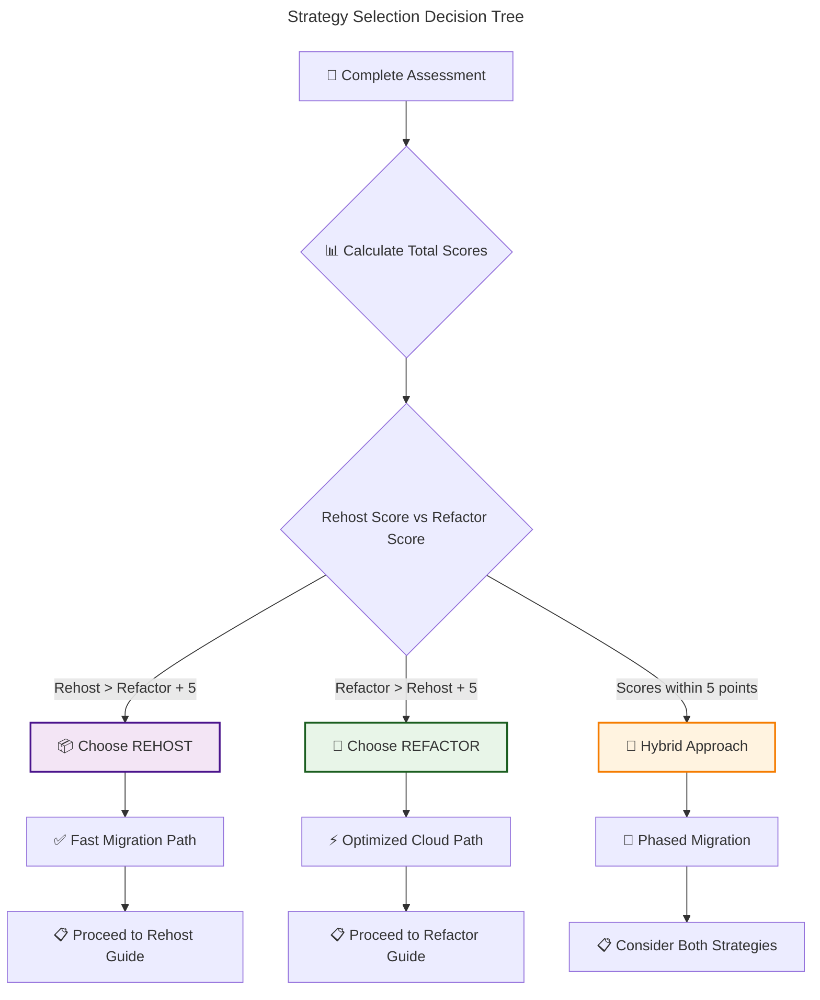
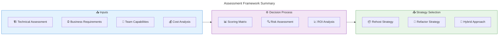

# 🧭 Strategy Selection Guide

**Making the right choice between Rehost and Refactor strategies**

---

## 🎯 Decision Framework

Choosing the right migration strategy is crucial for success. This guide provides a systematic approach to help you make informed decisions.

## 🔍 Assessment Questionnaire

### 📊 **Workload Assessment**

Answer these questions for each application you're planning to migrate:

#### 🏗️ **Technical Characteristics**

| Question | Rehost Score | Refactor Score |
|----------|--------------|----------------|
| **Application Age** | | |
| Legacy (10+ years) | +3 | 0 |
| Mature (5-10 years) | +2 | +1 |
| Modern (0-5 years) | +1 | +3 |
| **Code Maintainability** | | |
| Poor documentation, hard to modify | +3 | 0 |
| Some documentation, moderate changes possible | +2 | +2 |
| Well-documented, easy to modify | +1 | +3 |
| **Current Performance** | | |
| Acceptable, no issues | +3 | +1 |
| Some bottlenecks | +1 | +3 |
| Major performance issues | 0 | +3 |

#### ⏰ **Business Requirements**

| Question | Rehost Score | Refactor Score |
|----------|--------------|----------------|
| **Migration Timeline** | | |
| Urgent (< 3 months) | +3 | 0 |
| Moderate (3-6 months) | +2 | +2 |
| Flexible (6+ months) | +1 | +3 |
| **Budget Constraints** | | |
| Limited budget | +3 | 0 |
| Moderate budget | +2 | +2 |
| Flexible budget | +1 | +3 |
| **Risk Tolerance** | | |
| Low risk tolerance | +3 | +1 |
| Moderate risk tolerance | +2 | +2 |
| High risk tolerance | +1 | +3 |

#### 👥 **Team & Skills**

| Question | Rehost Score | Refactor Score |
|----------|--------------|----------------|
| **Cloud Expertise** | | |
| Limited cloud experience | +3 | 0 |
| Some cloud experience | +2 | +2 |
| Strong cloud expertise | +1 | +3 |
| **Development Resources** | | |
| Limited development capacity | +3 | 0 |
| Some development capacity | +2 | +2 |
| Strong development team | +1 | +3 |

### 📊 **Scoring Your Assessment**



## 🎯 Common Decision Scenarios

### 📦 **Strong Rehost Candidates**

**🏢 Scenario: Legacy ERP System**
- ✅ **10-year-old SAP system** with customizations
- ✅ **Critical business operations** depend on it
- ✅ **Limited development team** familiar with system
- ✅ **Tight migration deadline** due to data center closure
- ✅ **Regulatory requirements** for infrastructure control

**💡 Why Rehost?**
- Minimal disruption to business operations
- Leverages existing team knowledge
- Meets urgent timeline requirements
- Maintains regulatory compliance

### 🔄 **Strong Refactor Candidates**

**💻 Scenario: Customer Web Portal**
- ✅ **3-year-old .NET application** with good documentation
- ✅ **Performance issues** during peak traffic
- ✅ **Development team** available for enhancements
- ✅ **Cost optimization** is a priority
- ✅ **Scalability requirements** are growing

**💡 Why Refactor?**
- Leverage Azure App Service for better performance
- Implement auto-scaling for peak traffic
- Reduce long-term operational costs
- Improve development and deployment processes

### 🎯 **Hybrid Approach Scenarios**

**🏗️ Scenario: Multi-Tier Application**
- **Database tier**: Rehost to Azure SQL VM (complex stored procedures)
- **Application tier**: Refactor to Azure App Service (well-architected code)
- **Web tier**: Refactor to Azure Front Door + CDN (static content)

## 🔍 Detailed Decision Criteria

### 📦 **When to Choose Rehost**

#### ✅ **Technical Indicators**
- **Complex dependencies** that are hard to untangle
- **Legacy frameworks** not supported in PaaS
- **Custom kernel modules** or specific OS requirements
- **Third-party software** with licensing restrictions
- **Compliance requirements** for infrastructure control

#### ✅ **Business Indicators**
- **Time-critical migrations** (data center closure, contract expiration)
- **Limited budget** for application changes
- **Risk-averse organization** preferring minimal changes
- **Proof of concept** for cloud adoption

#### 📊 **Example Cost Analysis**
```
Rehost Costs:
├── 🚀 Migration: $10,000 (low complexity)
├── 💰 Monthly Operations: $5,000 (VM costs)
└── 🛠️ Ongoing Maintenance: High (OS patches, updates)

Total Year 1: $70,000
```

### 🔄 **When to Choose Refactor**

#### ✅ **Technical Indicators**
- **Well-architected applications** with clear separation of concerns
- **Standard frameworks** (.NET, Java, Node.js) supported by PaaS
- **Performance bottlenecks** that cloud services can address
- **Scalability requirements** that benefit from cloud elasticity
- **Integration needs** with other cloud services

#### ✅ **Business Indicators**
- **Long-term cloud strategy** with optimization goals
- **Development resources available** for modernization
- **Cost optimization** is a priority
- **Performance improvement** requirements

#### 📊 **Example Cost Analysis**
```
Refactor Costs:
├── 🚀 Migration: $50,000 (development effort)
├── 💰 Monthly Operations: $2,000 (PaaS services)
└── 🛠️ Ongoing Maintenance: Low (managed services)

Total Year 1: $74,000
Year 2+: $24,000/year (significant savings)
```

## 🛠️ Assessment Tools

### 📊 **Azure Migrate Hub**
- **Automated discovery** of on-premises workloads
- **Dependency mapping** for application relationships
- **Performance assessment** and right-sizing recommendations
- **Cost estimates** for different migration strategies

### 🔍 **Application Assessment Tools**
- **Azure App Service Migration Assistant** for web applications
- **Data Migration Assistant** for SQL Server databases
- **Server Assessment Tool** for infrastructure evaluation

### 📋 **Decision Matrix Template**



## 🎯 Decision Validation

### ✅ **Validation Checklist**

Before finalizing your strategy choice:

- [ ] **📊 Assessment scores** clearly favor one approach
- [ ] **👥 Stakeholder alignment** on chosen strategy
- [ ] **💰 Budget approval** for estimated costs
- [ ] **⏰ Timeline feasibility** confirmed
- [ ] **🛡️ Risk mitigation** plans in place
- [ ] **📋 Success criteria** defined and measurable

### 🔄 **Strategy Review Points**

Plan to review your strategy at these milestones:
- **📋 After pilot migration** (first application)
- **📊 Every 10 applications** migrated
- **🎯 At major project phases** (quarterly reviews)
- **⚠️ When issues arise** that challenge assumptions

---

## 🎯 Key Takeaways

- **📊 Use the scoring matrix** to objectively assess each workload
- **🎯 Consider hybrid approaches** when scores are close
- **💰 Factor in total cost of ownership**, not just migration costs
- **⏰ Balance speed vs. optimization** based on business priorities
- **🔄 Strategy can vary by application** - one size doesn't fit all
- **📋 Document decisions** and rationale for future reference

---

**📖 Next Steps:**
- 📦 **Chosen Rehost?** → [Rehost Overview](../02-rehost/overview.md)
- 🔄 **Chosen Refactor?** → [Refactor Overview](../03-refactor/overview.md)
- 🤔 **Need more planning?** → [Prerequisites & Planning](./prerequisites.md)
- [Azure VM Baseline Landing Zone](../azure-vm-baseline-landing-zone.md)
- [Azure Migration GitHub Repository](../azure-migration-github-repo.md)
