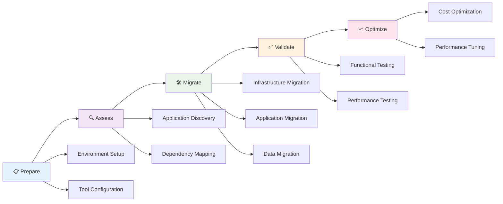
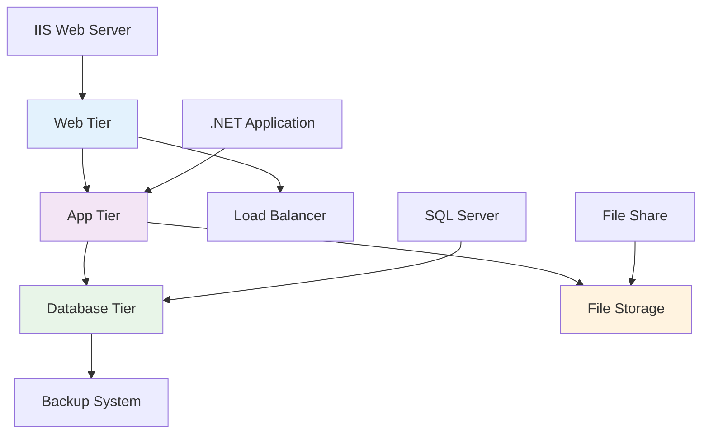
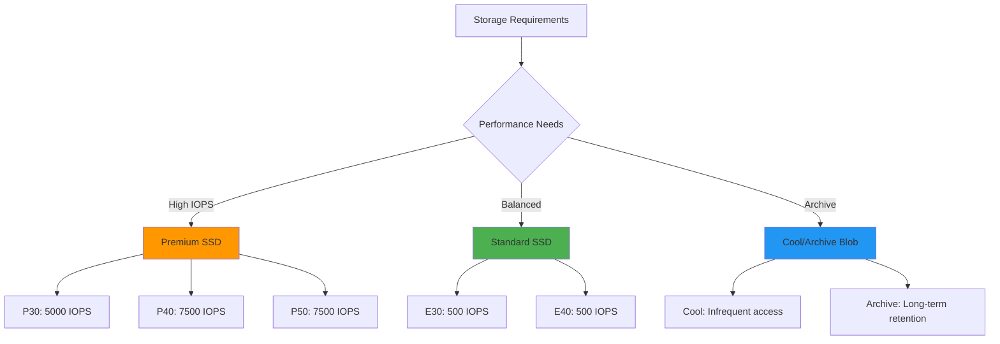

# 🚀 Rehost Implementation Guide

**Step-by-step guide for executing Azure Rehost migration strategy**

---

## 🎯 Overview

This guide provides detailed implementation steps for the Rehost (Lift & Shift) migration strategy, enabling rapid migration to Azure with minimal changes to existing applications.

## 📋 Implementation Phases

### 📊 Phase Overview



## 🛠️ Phase 1: Preparation

### 🏗️ Environment Setup

#### **Azure Landing Zone Configuration**

```bash
# Create Resource Group
az group create --name rg-migration-prod --location eastus

# Create Virtual Network
az network vnet create \
  --resource-group rg-migration-prod \
  --name vnet-migration \
  --address-prefix 10.0.0.0/16 \
  --subnet-name subnet-web \
  --subnet-prefix 10.0.1.0/24

# Create Network Security Group
az network nsg create \
  --resource-group rg-migration-prod \
  --name nsg-web-tier
```

#### **Migration Tools Setup**

| **Tool** | **Purpose** | **Configuration** |
|----------|-------------|-------------------|
| 🔄 **Azure Migrate** | Server assessment & migration | Configure project and appliance |
| 📊 **Azure Site Recovery** | VM replication | Set up vault and policies |
| 🗄️ **Database Migration Service** | Database migration | Configure DMS instance |
| 🔍 **Log Analytics** | Monitoring setup | Create workspace |

### 🔐 Security Configuration

#### **Identity and Access Management**

```json
{
  "roleAssignments": [
    {
      "role": "Contributor",
      "scope": "/subscriptions/{subscription-id}/resourceGroups/rg-migration-prod",
      "principalId": "{migration-team-group-id}"
    },
    {
      "role": "Virtual Machine Contributor",
      "scope": "/subscriptions/{subscription-id}/resourceGroups/rg-migration-prod",
      "principalId": "{vm-admin-group-id}"
    }
  ]
}
```

## 🔍 Phase 2: Assessment & Discovery

### 📊 Application Portfolio Analysis

#### **Discovery Checklist**

- [ ] **🖥️ Virtual Machines**: Inventory all VMs and their configurations
- [ ] **🗄️ Databases**: Catalog database instances and versions
- [ ] **💾 Storage**: Map storage systems and capacity
- [ ] **🌐 Networking**: Document network topology and dependencies
- [ ] **🔗 Applications**: Identify application tiers and connections

### 🔄 Dependency Mapping



### 📈 Sizing and Performance Analysis

#### **Resource Requirements Mapping**

| **On-Premises** | **Azure Equivalent** | **Sizing Factor** |
|-----------------|---------------------|-------------------|
| 4 vCPU, 16GB RAM | Standard_D4s_v3 | 1:1 mapping |
| 8 vCPU, 32GB RAM | Standard_D8s_v3 | 1:1 mapping |
| 500GB SSD | Premium SSD P20 | Performance tier |
| 1TB HDD | Standard SSD E30 | Cost optimization |

## 🚀 Phase 3: Migration Execution

### 🖥️ Virtual Machine Migration

#### **Azure Site Recovery Setup**

```bash
# Create Recovery Services Vault
az backup vault create \
  --resource-group rg-migration-prod \
  --name vault-migration-asr \
  --location eastus

# Configure replication policy
az backup policy create \
  --resource-group rg-migration-prod \
  --vault-name vault-migration-asr \
  --name VMReplicationPolicy \
  --policy vm-replication-policy.json
```

#### **Migration Steps**

1. **🔧 Prepare Source Environment**
   - Install Azure Site Recovery agent
   - Configure network connectivity
   - Validate prerequisites

2. **🔄 Enable Replication**
   - Select VMs for replication
   - Configure target resources
   - Start initial replication

3. **✅ Validate Replication**
   - Monitor replication health
   - Perform test failover
   - Validate application functionality

4. **🎯 Execute Cutover**
   - Schedule maintenance window
   - Perform final failover
   - Update DNS records

### 🗄️ Database Migration

#### **SQL Server Migration**

```sql
-- Pre-migration checklist
SELECT 
    name,
    compatibility_level,
    collation_name,
    state_desc
FROM sys.databases
WHERE database_id > 4;

-- Check for unsupported features
SELECT 
    feature_name,
    feature_id
FROM sys.dm_db_persisted_sku_features;
```

#### **Migration Approaches**

| **Method** | **Downtime** | **Use Case** |
|------------|--------------|--------------|
| 🔄 **Backup/Restore** | Hours | Small databases |
| 📡 **Replication** | Minutes | Large databases |
| 🚛 **DMS** | Minimal | Online migration |
| 💾 **Import/Export** | Hours | Data migration only |

### 💾 Storage Migration

#### **Azure Storage Types**



## ✅ Phase 4: Validation & Testing

### 🧪 Testing Framework

#### **Test Categories**

| **Test Type** | **Scope** | **Success Criteria** |
|---------------|-----------|----------------------|
| 🔧 **Functional** | Application features | 100% feature parity |
| ⚡ **Performance** | Response times | <20% degradation |
| 🛡️ **Security** | Access controls | All controls functional |
| 🔄 **Integration** | System connections | All integrations working |

#### **Performance Validation**

```bash
# CPU and Memory monitoring
az vm show \
  --resource-group rg-migration-prod \
  --name vm-web-01 \
  --show-details

# Application performance testing
curl -w "@curl-format.txt" -o /dev/null -s "https://app.contoso.com/health"
```

### 📊 Post-Migration Checklist

- [ ] **🔍 Application Functionality**: All features working correctly
- [ ] **📈 Performance Baselines**: Metrics within acceptable range
- [ ] **🛡️ Security Controls**: All security measures active
- [ ] **💾 Data Integrity**: Data validation completed
- [ ] **🔄 Backup Verification**: Backup systems operational
- [ ] **📱 User Access**: All users can access applications
- [ ] **📊 Monitoring**: Monitoring and alerting configured

## 📈 Phase 5: Optimization

### 💰 Cost Optimization

#### **Immediate Optimizations**

| **Optimization** | **Savings** | **Implementation** |
|------------------|-------------|-------------------|
| 🎛️ **Right-sizing** | 20-30% | Adjust VM sizes based on utilization |
| 💾 **Storage Tiering** | 15-25% | Move to appropriate storage tiers |
| 🕒 **Reserved Instances** | 30-60% | Purchase 1-3 year reservations |
| 🌙 **Auto-shutdown** | 10-15% | Schedule non-prod environment shutdowns |

#### **Cost Monitoring Setup**

```json
{
  "budgets": [
    {
      "name": "Migration-Project-Budget",
      "amount": 50000,
      "timeGrain": "Monthly",
      "alerts": [
        {
          "threshold": 80,
          "operator": "GreaterThan",
          "contactEmails": ["finance@contoso.com"]
        }
      ]
    }
  ]
}
```

### ⚡ Performance Optimization

#### **Monitoring Configuration**

```bash
# Enable diagnostic settings
az monitor diagnostic-settings create \
  --resource /subscriptions/{sub-id}/resourceGroups/rg-migration-prod/providers/Microsoft.Compute/virtualMachines/vm-web-01 \
  --name vm-diagnostics \
  --logs '[{"category": "Administrative", "enabled": true}]' \
  --metrics '[{"category": "AllMetrics", "enabled": true}]' \
  --workspace /subscriptions/{sub-id}/resourceGroups/rg-migration-prod/providers/Microsoft.OperationalInsights/workspaces/log-analytics-workspace
```

## 🚨 Common Challenges & Solutions

### ⚠️ Challenge Matrix

| **Challenge** | **Impact** | **Solution** | **Prevention** |
|---------------|------------|--------------|----------------|
| 🔌 **Connectivity Issues** | High | VPN/ExpressRoute troubleshooting | Network testing |
| 📊 **Performance Degradation** | Medium | Resource optimization | Proper sizing |
| 🛡️ **Security Gaps** | High | Security hardening | Security review |
| 💰 **Cost Overruns** | Medium | Budget monitoring | Cost planning |

### 🔧 Troubleshooting Guide

#### **Common Issues**

1. **Network Connectivity**
   ```bash
   # Test connectivity
   Test-NetConnection -ComputerName vm-web-01.eastus.cloudapp.azure.com -Port 443
   
   # Check NSG rules
   az network nsg rule list --resource-group rg-migration-prod --nsg-name nsg-web-tier
   ```

2. **Performance Issues**
   ```bash
   # Check VM metrics
   az monitor metrics list \
     --resource /subscriptions/{sub-id}/resourceGroups/rg-migration-prod/providers/Microsoft.Compute/virtualMachines/vm-web-01 \
     --metric "Percentage CPU"
   ```

## 📚 Success Criteria

### ✅ Migration Completion Criteria

- [ ] **🎯 Functional Parity**: 100% of application features working
- [ ] **⚡ Performance**: <20% performance degradation
- [ ] **🛡️ Security**: All security controls implemented
- [ ] **💰 Cost**: Within 10% of budget
- [ ] **📅 Timeline**: Delivered on schedule
- [ ] **👥 User Satisfaction**: >90% user acceptance

---

### 🔗 Related Resources

- 📖 [Rehost Best Practices](best-practices.md)
- 🎯 [Rehost Use Cases](use-cases.md)
- 🛠️ [Migration Tools](../05-tools/migration-tools.md)
- 📊 [Performance Monitoring](../04-frameworks/waf-alignment.md#performance-efficiency)

---

**📅 Last Updated**: May 2025  
**👥 Contributors**: Cloud Migration Team  
**🔄 Review Cycle**: Monthly during active migrations
