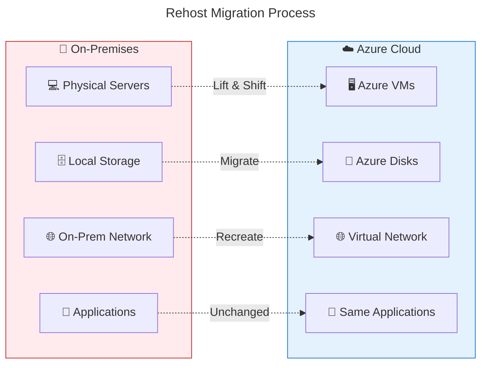
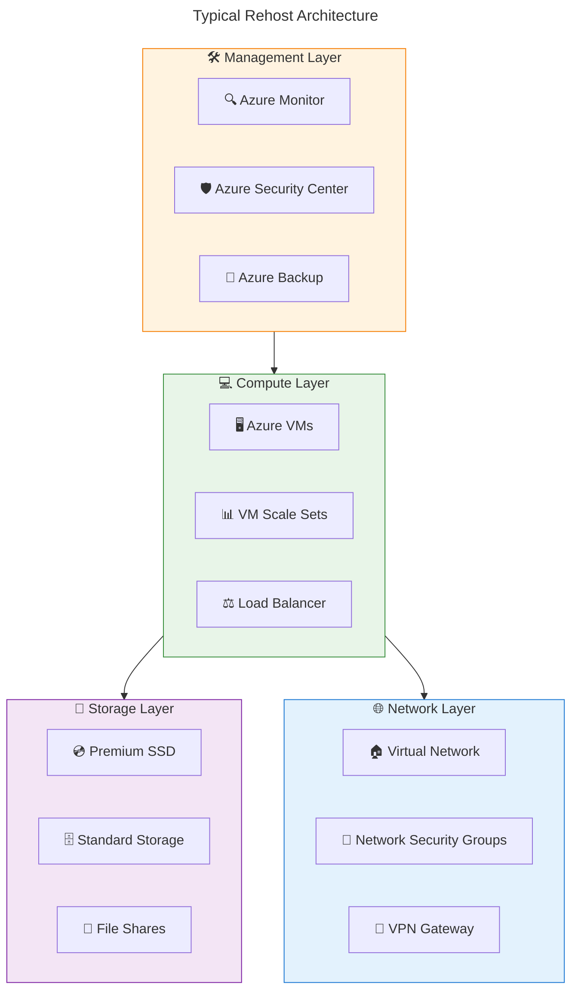
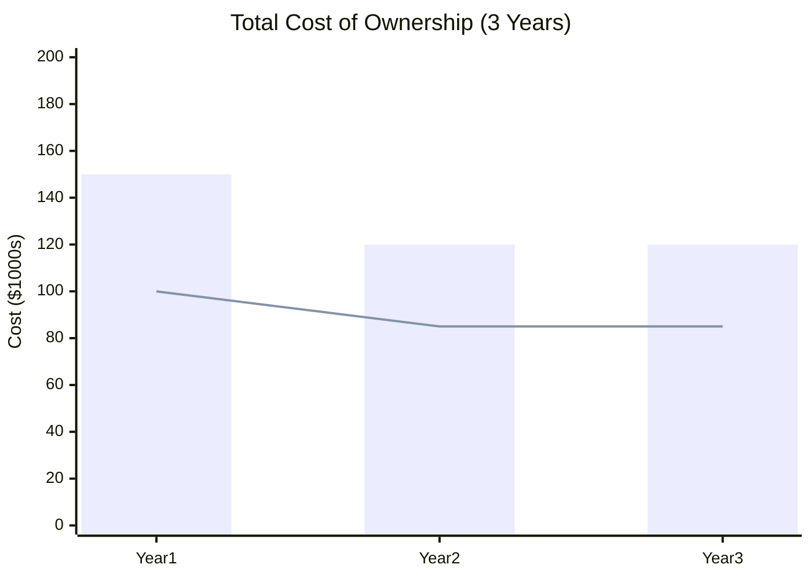
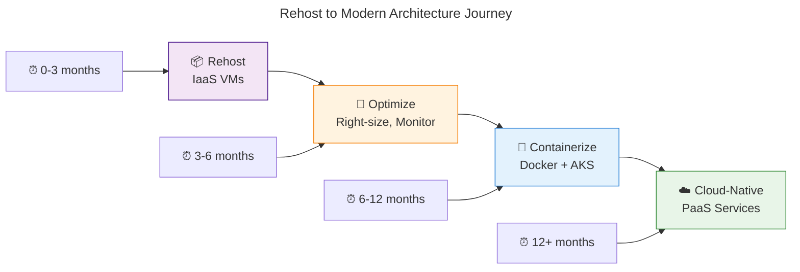

# 📦 Rehost Strategy Overview

**Lift and Shift: Moving to Azure with minimal changes**

---

## 🎯 What is Rehost (Lift & Shift)?

**Rehosting** is the process of moving applications from on-premises infrastructure to Azure cloud **without modifying the application code**. Think of it as relocating your office to a new building - you're moving the same furniture and equipment, just to a better location.

### 🏗️ Core Concept



## ✅ Key Benefits of Rehost

### 🚀 **Speed & Simplicity**
- **⚡ Fastest migration path** - typically weeks vs. months
- **🔧 Minimal complexity** - no code changes required
- **📋 Predictable process** - well-established methodologies
- **👥 Lower skill requirements** - infrastructure focus vs. development

### 💰 **Cost Effectiveness**
- **🎯 Lower upfront investment** in migration effort
- **💵 Immediate cost benefits** from cloud infrastructure
- **📊 Predictable migration costs** - mainly infrastructure setup
- **⏰ Faster time to value** - quicker business benefits

### 🛡️ **Risk Reduction**
- **🔒 Application stability** - no code changes mean lower risk
- **📋 Proven migration patterns** - mature tooling and processes
- **🔙 Easier rollback** if issues occur
- **👨‍💼 Business continuity** - minimal disruption to operations

### 📈 **Strategic Advantages**
- **🏁 Quick wins** for cloud adoption initiatives
- **🎓 Learning opportunity** for cloud operations
- **🔄 Foundation for future optimization** - can refactor later
- **✅ Compliance maintenance** - keeps existing security posture

## 🎯 Ideal Rehost Scenarios

### ✅ **Perfect Candidates**

#### 🏢 **Legacy Enterprise Applications**
```
Examples:
├── 📊 ERP Systems (SAP, Oracle)
├── 🗄️ Legacy databases with complex schemas
├── 📝 Document management systems
└── 🔧 Custom business applications with dependencies
```

#### ⏰ **Time-Critical Migrations**
```
Scenarios:
├── 🏢 Data center closures or lease expiration
├── 📋 Compliance mandates with tight deadlines
├── 💰 Budget cycles requiring quick cloud adoption
└── 🛡️ Security incidents requiring rapid migration
```

#### 🛠️ **Complex Dependencies**
```
Characteristics:
├── 🔗 Tightly coupled application components
├── 🗄️ Shared databases across multiple applications
├── 🌐 Complex networking requirements
└── 🔐 Specialized security configurations
```

## 🚫 Rehost Limitations

### ⚠️ **What Rehost Doesn't Provide**

- **📈 Limited performance optimization** - same application bottlenecks remain
- **💰 Higher long-term costs** - VM management overhead continues
- **🔧 Ongoing maintenance burden** - OS patching, security updates
- **📊 No cloud-native benefits** - auto-scaling, managed services

### 🛑 **Poor Rehost Candidates**

#### ❌ **Applications That Shouldn't Be Rehosted**
```
Avoid Rehost for:
├── 🕰️ End-of-life applications (retire instead)
├── 📱 Modern web applications (refactor to PaaS)
├── 🔄 Applications with frequent updates (benefit from DevOps)
└── 💸 Cost-sensitive workloads (PaaS often cheaper)
```

## 🏗️ Azure Rehost Architecture

### 🖥️ **Core Azure Services for Rehost**



### 🛠️ **Service Mapping Guide**

| On-Premises Component | Azure Equivalent | Purpose |
|----------------------|------------------|---------|
| **🖥️ Physical Servers** | Azure Virtual Machines | Primary compute resources |
| **💾 Local Storage** | Azure Managed Disks | Persistent storage for VMs |
| **🌐 Network Switches** | Virtual Network | Network connectivity |
| **🔥 Firewalls** | Network Security Groups | Traffic filtering |
| **⚖️ Load Balancers** | Azure Load Balancer | Traffic distribution |
| **📊 Monitoring Tools** | Azure Monitor | Performance monitoring |
| **🔄 Backup Systems** | Azure Backup | Data protection |

## 📊 Rehost vs. Stay On-Premises

### 💰 **Cost Comparison Example**



**📈 Breakdown:**
- **🔴 On-Premises Bar**: Hardware refresh, maintenance, facility costs
- **🔵 Azure Rehost Line**: VM costs with reserved instances and optimization

### ⚡ **Performance Considerations**

| Aspect | On-Premises | Azure Rehost | Notes |
|--------|-------------|--------------|-------|
| **🚀 Performance** | Baseline | Similar to baseline | Network latency may vary |
| **📈 Scalability** | Limited by hardware | Manual scaling | Can add VMs as needed |
| **🔄 Availability** | Hardware dependent | 99.95% SLA | Azure infrastructure reliability |
| **🛡️ Security** | Your responsibility | Shared responsibility | Azure handles infrastructure security |

## 🎯 Success Metrics

### 📊 **Key Performance Indicators (KPIs)**

#### ✅ **Migration Success Metrics**
- **⏰ Migration timeline adherence** (target: within planned schedule)
- **💰 Budget compliance** (target: within 10% of estimated costs)
- **🔧 Application functionality** (target: 100% feature parity)
- **📊 Performance baselines** (target: maintain or improve response times)

#### 📈 **Post-Migration Benefits**
- **💵 Infrastructure cost reduction** (typical: 20-30% Year 1)
- **⚡ Improved availability** (target: >99.9% uptime)
- **🛡️ Enhanced security posture** (Azure security features)
- **🔄 Backup and recovery improvement** (target: RTO/RPO improvements)

### 📋 **Success Criteria Checklist**

- [ ] **🎯 All applications migrated** without functionality loss
- [ ] **👥 User acceptance** achieved with minimal complaints
- [ ] **📊 Performance benchmarks** met or exceeded
- [ ] **🛡️ Security compliance** maintained or improved
- [ ] **💰 Cost targets** achieved within tolerance
- [ ] **📚 Knowledge transfer** completed to operations team

## 🔄 Post-Rehost Optimization

### 🎯 **Quick Wins After Migration**

#### 💰 **Cost Optimization**
```
Immediate Actions:
├── 🏷️ Apply Azure Reserved Instances (save 30-70%)
├── 📊 Right-size VMs based on actual usage
├── ⏰ Schedule non-production VMs (auto-shutdown)
└── 🗄️ Optimize storage tiers (hot/cool/archive)
```

#### ⚡ **Performance Optimization**
```
Quick Improvements:
├── 🚀 Premium SSD for database VMs
├── 📊 Enable accelerated networking
├── 🔄 Implement Azure Load Balancer
└── 📈 Set up auto-scaling for predictable workloads
```

### 🚀 **Future Modernization Path**



---

## 🎯 Key Takeaways

- **📦 Rehost is the fastest path** to cloud adoption with minimal risk
- **💰 Provides immediate infrastructure benefits** without code changes
- **🎯 Ideal for legacy applications** and time-critical migrations
- **🔧 Limited optimization benefits** compared to cloud-native approaches
- **🚀 Serves as foundation** for future cloud modernization
- **📊 Success depends on proper planning** and realistic expectations

---

**📖 Next Steps:**
- 🔧 [Implementation Guide](./implementation.md) - Step-by-step rehost process
- 💡 [Best Practices](./best-practices.md) - Proven strategies for success
- 📈 [Use Cases & Examples](./use-cases.md) - Real-world scenarios
