# 🏗️ Refactor Implementation Guide

**Comprehensive guide for Azure Refactor migration with cloud-native transformation**

---

## 🎯 Overview

This guide provides detailed implementation steps for the Refactor migration strategy, focusing on modernizing applications to leverage Azure PaaS and cloud-native capabilities for maximum business value.

## 📋 Implementation Methodology

### 🔄 Transformation Approach

```mermaid
flowchart TB
    A[🔍 Application Analysis] --> B[🎯 Target Architecture]
    B --> C[📋 Modernization Plan]
    C --> D[🛠️ Implementation Phases]
    D --> E[✅ Validation & Testing]
    E --> F[🚀 Production Deployment]
    F --> G[📈 Continuous Optimization]
    
    A --> A1[Code Assessment]
    A --> A2[Architecture Review]
    A --> A3[Dependency Analysis]
    
    B --> B1[Service Selection]
    B --> B2[Integration Design]
    B --> B3[Data Strategy]
    
    C --> C1[Development Roadmap]
    C --> C2[Risk Mitigation]
    C --> C3[Resource Planning]
    
    D --> D1[Incremental Migration]
    D --> D2[Parallel Development]
    D --> D3[Feature Toggles]
    
    style A fill:#e3f2fd
    style B fill:#f3e5f5
    style C fill:#e8f5e8
    style D fill:#fff3e0
    style E fill:#fce4ec
    style F fill:#e0f2f1
    style G fill:#fff8e1
```



## 🔍 Phase 1: Application Analysis

### 📊 Code Assessment Framework

#### **Application Modernization Assessment**

| **Assessment Area** | **Current State** | **Target State** | **Effort** |
|-------------------|------------------|----------------|------------|
| 🏗️ **Architecture** | Monolithic | Microservices | High |
| 💾 **Data Layer** | SQL Server | Cosmos DB + SQL | Medium |
| 🔐 **Authentication** | Windows Auth | Azure AD B2C | Low |
| 📡 **Communication** | Synchronous | Event-driven | High |
| 🔍 **Monitoring** | Basic logging | Application Insights | Low |

#### **Code Quality Analysis**

```csharp
// Example: Dependency analysis tool output
public class DependencyReport
{
    public List<ComponentDependency> Dependencies { get; set; }
    public CloudReadinessScore ReadinessScore { get; set; }
    public List<RefactoringRecommendation> Recommendations { get; set; }
}

public class CloudReadinessScore
{
    public int Overall { get; set; } // 1-10 scale
    public int Statelessness { get; set; }
    public int ConfigurationExternalization { get; set; }
    public int DataPortability { get; set; }
    public int ServiceBoundaries { get; set; }
}
```

### 🎯 Architecture Modernization Patterns

#### **Pattern Selection Matrix**


## 🎯 Phase 2: Target Architecture Design

### 🏗️ Azure Service Selection

#### **Service Mapping Strategy**

| **Application Layer** | **Current** | **Azure Target** | **Benefits** |
|----------------------|-------------|------------------|--------------|
| 🌐 **Web Frontend** | IIS/ASP.NET | App Service | Auto-scaling, SSL, deployment slots |
| ⚙️ **API Layer** | WCF Services | API Management + Functions | Rate limiting, analytics, serverless |
| 💼 **Business Logic** | Windows Services | Container Apps | Microservices, event-driven |
| 💾 **Data Layer** | SQL Server | Cosmos DB + SQL Database | Global distribution, automatic scaling |
| 🔍 **Search** | Full-text search | Cognitive Search | AI-powered, semantic search |
| 📊 **Analytics** | SSRS | Power BI Embedded | Real-time dashboards, AI insights |

### 🗄️ Data Modernization Strategy

#### **Data Architecture Transformation**


#### **Data Migration Patterns**

| **Pattern** | **Use Case** | **Implementation** | **Complexity** |
|-------------|--------------|-------------------|----------------|
| 🔄 **Database per Service** | Microservices | Separate databases for each service | High |
| 📊 **CQRS** | Read/Write separation | Command and Query responsibility separation | Medium |
| 🌊 **Event Sourcing** | Audit requirements | Store events instead of current state | High |
| 🔗 **Data Federation** | Legacy integration | Virtual data layer | Medium |

## 🛠️ Phase 3: Implementation Strategy

### 🚀 Modernization Patterns Implementation

#### **Strangler Fig Pattern**

```csharp
// Example: Gradual service replacement
public class ModernizationFacade
{
    private readonly ILegacyService _legacyService;
    private readonly IModernService _modernService;
    private readonly IFeatureToggleService _featureToggle;

    public async Task<OrderResult> ProcessOrder(OrderRequest request)
    {
        // Feature toggle determines routing
        if (await _featureToggle.IsEnabledAsync("UseModernOrderService"))
        {
            return await _modernService.ProcessOrderAsync(request);
        }
        
        return await _legacyService.ProcessOrder(request);
    }
}
```

#### **API Gateway Implementation**

```yaml
# Azure API Management policy example
policies:
  inbound:
    - rate-limit:
        calls: 1000
        renewal-period: 3600
    - authenticate-with-managed-identity:
        resource: https://graph.microsoft.com/
    - transform-request:
        remove-headers: ["X-Internal-Token"]
  backend:
    - load-balancer:
        backend-pool: modern-services
        fallback: legacy-services
  outbound:
    - transform-response:
        add-headers:
          - name: X-Powered-By
            value: Azure-Modern-Stack
```

### 🐳 Containerization Strategy

#### **Container Migration Approach**

```dockerfile
# Multi-stage build for .NET application
FROM mcr.microsoft.com/dotnet/sdk:8.0 AS build
WORKDIR /src
COPY ["ContosoApp.csproj", "."]
RUN dotnet restore
COPY . .
RUN dotnet publish -c Release -o /app/publish

FROM mcr.microsoft.com/dotnet/aspnet:8.0
WORKDIR /app
COPY --from=build /app/publish .

# Health check endpoint
HEALTHCHECK --interval=30s --timeout=3s --start-period=5s --retries=3 \
  CMD curl -f http://localhost:8080/health || exit 1

EXPOSE 8080
ENTRYPOINT ["dotnet", "ContosoApp.dll"]
```

#### **Azure Container Apps Configuration**

```yaml
apiVersion: apps/v1alpha1
kind: ContainerApp
metadata:
  name: contoso-api
spec:
  configuration:
    ingress:
      external: true
      targetPort: 8080
      cors:
        allowCredentials: true
        allowedOrigins: ["https://contoso.com"]
    secrets:
      - name: cosmos-connection
        value: ${COSMOS_CONNECTION_STRING}
  template:
    containers:
      - name: api
        image: contoso.azurecr.io/api:latest
        env:
          - name: CosmosDB__ConnectionString
            secretRef: cosmos-connection
        resources:
          cpu: "0.5"
          memory: "1Gi"
    scale:
      minReplicas: 1
      maxReplicas: 10
      rules:
        - name: http-scaling
          http:
            concurrent-requests: 50
```

### 🌐 Microservices Architecture

#### **Service Decomposition Strategy**


#### **Event-Driven Communication**

```csharp
// Event-driven architecture implementation
public class OrderCreatedEvent
{
    public Guid OrderId { get; set; }
    public Guid CustomerId { get; set; }
    public decimal TotalAmount { get; set; }
    public DateTime CreatedAt { get; set; }
}

public class OrderService
{
    private readonly IEventBus _eventBus;
    
    public async Task<Order> CreateOrderAsync(CreateOrderRequest request)
    {
        var order = new Order(request);
        await _repository.SaveAsync(order);
        
        // Publish event for other services
        await _eventBus.PublishAsync(new OrderCreatedEvent
        {
            OrderId = order.Id,
            CustomerId = order.CustomerId,
            TotalAmount = order.Total,
            CreatedAt = DateTime.UtcNow
        });
        
        return order;
    }
}
```

## 📊 Phase 4: Data Modernization

### 🗄️ Database Modernization Patterns

#### **Polyglot Persistence Strategy**

| **Data Type** | **Azure Service** | **Use Case** | **Benefits** |
|---------------|-------------------|--------------|--------------|
| 📋 **Transactional** | Azure SQL Database | ACID requirements | Consistency, relationships |
| 📄 **Document** | Cosmos DB | Flexible schema | Global distribution, scalability |
| 🔍 **Search** | Cognitive Search | Full-text search | AI-powered, faceted search |
| 📊 **Time-series** | Time Series Insights | IoT/telemetry data | Built-in analytics |
| 🗄️ **Cache** | Redis Cache | Session/cache data | Low latency, high throughput |

#### **Data Migration Implementation**

```csharp
// Data migration service example
public class DataMigrationService
{
    private readonly ISqlRepository _sqlRepo;
    private readonly ICosmosRepository _cosmosRepo;
    
    public async Task MigrateCustomerDataAsync()
    {
        var customers = await _sqlRepo.GetAllCustomersAsync();
        
        foreach (var customer in customers)
        {
            var cosmosCustomer = new CosmosCustomer
            {
                id = customer.Id.ToString(),
                PartitionKey = customer.Region,
                Profile = new CustomerProfile
                {
                    Name = customer.Name,
                    Email = customer.Email,
                    Preferences = customer.Preferences
                },
                Addresses = customer.Addresses.Select(a => new Address
                {
                    Type = a.Type,
                    Line1 = a.Line1,
                    City = a.City,
                    PostalCode = a.PostalCode
                }).ToList()
            };
            
            await _cosmosRepo.UpsertAsync(cosmosCustomer);
        }
    }
}
```

### 🌊 Event Streaming Implementation

#### **Azure Event Hub Configuration**

```json
{
  "eventHub": {
    "connectionString": "${EVENT_HUB_CONNECTION_STRING}",
    "consumerGroup": "order-processing",
    "partitionCount": 4,
    "retentionDays": 7,
    "captureEnabled": true,
    "captureDestination": {
      "storageAccount": "contosodatalake",
      "blobContainer": "events",
      "nameFormat": "{Namespace}/{EventHub}/{PartitionId}/{Year}/{Month}/{Day}/{Hour}/{Minute}/{Second}"
    }
  }
}
```

## ✅ Phase 5: Testing & Validation

### 🧪 Comprehensive Testing Strategy

#### **Testing Pyramid for Cloud-Native Apps**

```mermaid
pyramid
    title Testing Strategy
    
    "E2E Tests" : 10
    "Integration Tests" : 30  
    "Unit Tests" : 60
```

#### **Test Categories Implementation**

| **Test Type** | **Scope** | **Tools** | **Coverage** |
|---------------|-----------|-----------|--------------|
| 🔬 **Unit Tests** | Individual components | xUnit, NUnit | >80% code coverage |
| 🔗 **Integration Tests** | Service interactions | TestContainers | All API endpoints |
| 🏗️ **Contract Tests** | API contracts | Pact | Consumer/Provider |
| ⚡ **Performance Tests** | Load/stress testing | Azure Load Testing | Critical paths |
| 🛡️ **Security Tests** | Vulnerabilities | OWASP ZAP | Security baselines |

#### **Cloud-Native Testing Examples**

```csharp
// Integration test with TestContainers
[Test]
public async Task Should_Create_Order_Successfully()
{
    // Arrange
    using var cosmosContainer = new CosmosDbBuilder()
        .WithImage("mcr.microsoft.com/cosmosdb/linux/azure-cosmos-emulator")
        .Build();
    
    await cosmosContainer.StartAsync();
    
    var client = new OrderServiceClient(cosmosContainer.GetConnectionString());
    
    // Act
    var result = await client.CreateOrderAsync(new CreateOrderRequest
    {
        CustomerId = Guid.NewGuid(),
        Items = new[] { new OrderItem { ProductId = 1, Quantity = 2 } }
    });
    
    // Assert
    Assert.That(result.Success, Is.True);
    Assert.That(result.OrderId, Is.Not.EqualTo(Guid.Empty));
}
```

### 📊 Performance Validation

#### **Performance Benchmarking**

```yaml
# Azure Load Testing configuration
version: v0.1
testPlan:
  testName: "Order API Load Test"
  description: "Performance test for order creation API"
  
engines:
  - name: "load-test-engine"
    instanceCount: 5
    
scenarios:
  - name: "create-order"
    requests:
      - url: "https://api.contoso.com/orders"
        method: "POST"
        headers:
          Content-Type: "application/json"
        body: |
          {
            "customerId": "{{customerId}}",
            "items": [
              {"productId": 1, "quantity": 2}
            ]
          }
    
loadPattern:
  type: "ramp"
  initialUsers: 10
  targetUsers: 500
  rampDuration: "5m"
  sustainDuration: "10m"

successCriteria:
  - metric: "response_time_ms"
    operator: "lessThan"
    value: 2000
  - metric: "error_percentage"
    operator: "lessThan"
    value: 5
```

## 🚀 Phase 6: Production Deployment

### 🔄 Deployment Strategy

#### **Blue-Green Deployment**

```yaml
# Azure DevOps pipeline for blue-green deployment
stages:
- stage: DeployToBlue
  jobs:
  - job: DeployAPI
    steps:
    - task: AzureContainerApps@1
      inputs:
        azureSubscription: 'Production'
        containerAppName: 'contoso-api-blue'
        resourceGroup: 'rg-contoso-prod'
        imageToDeploy: 'contoso.azurecr.io/api:$(Build.BuildId)'
        
- stage: SmokeTests
  dependsOn: DeployToBlue
  jobs:
  - job: HealthCheck
    steps:
    - script: |
        curl -f https://contoso-api-blue.azurecontainerapps.io/health
        
- stage: SwitchTraffic
  dependsOn: SmokeTests
  jobs:
  - job: UpdateTrafficSplit
    steps:
    - task: AzureCLI@2
      inputs:
        scriptType: 'bash'
        scriptLocation: 'inlineScript'
        inlineScript: |
          az containerapp revision set-traffic \
            --name contoso-api \
            --resource-group rg-contoso-prod \
            --traffic-weights blue=100
```

### 📊 Monitoring & Observability

#### **Application Insights Configuration**

```csharp
// Enhanced telemetry configuration
public class TelemetryConfiguration
{
    public static void ConfigureServices(IServiceCollection services)
    {
        services.AddApplicationInsightsTelemetry();
        
        // Custom telemetry initializer
        services.AddSingleton<ITelemetryInitializer, CustomTelemetryInitializer>();
        
        // Dependency tracking
        services.AddApplicationInsightsTelemetryProcessor<DependencyTrackingTelemetryProcessor>();
        
        // Custom metrics
        services.AddSingleton<IMetricsCollector, ApplicationInsightsMetricsCollector>();
    }
}

public class OrderController : ControllerBase
{
    private readonly ILogger<OrderController> _logger;
    private readonly TelemetryClient _telemetryClient;
    
    [HttpPost]
    public async Task<IActionResult> CreateOrder([FromBody] CreateOrderRequest request)
    {
        using var activity = Activity.StartActivity("CreateOrder");
        activity?.SetTag("order.customer_id", request.CustomerId.ToString());
        
        var stopwatch = Stopwatch.StartNew();
        
        try
        {
            var result = await _orderService.CreateOrderAsync(request);
            
            _telemetryClient.TrackEvent("OrderCreated", new Dictionary<string, string>
            {
                ["CustomerId"] = request.CustomerId.ToString(),
                ["OrderValue"] = result.TotalAmount.ToString("C")
            });
            
            return Ok(result);
        }
        catch (Exception ex)
        {
            _logger.LogError(ex, "Failed to create order for customer {CustomerId}", request.CustomerId);
            _telemetryClient.TrackException(ex);
            throw;
        }
        finally
        {
            _telemetryClient.TrackMetric("OrderCreation.Duration", stopwatch.ElapsedMilliseconds);
        }
    }
}
```

## 📈 Phase 7: Continuous Optimization

### 💰 Cost Optimization Strategies

#### **FinOps Implementation**

| **Strategy** | **Implementation** | **Expected Savings** |
|--------------|-------------------|---------------------|
| 🎛️ **Auto-scaling** | Container Apps KEDA | 30-50% compute costs |
| 💾 **Storage Tiering** | Lifecycle management | 20-40% storage costs |
| 🕒 **Reserved Capacity** | Cosmos DB reservation | 20-65% database costs |
| 🔍 **Right-sizing** | Monitor and adjust | 15-30% overall costs |

#### **Performance Optimization**

```csharp
// Performance optimization example
public class OptimizedOrderService
{
    private readonly IMemoryCache _cache;
    private readonly ICosmosRepository _cosmosRepo;
    
    public async Task<Order> GetOrderAsync(Guid orderId)
    {
        var cacheKey = $"order:{orderId}";
        
        if (_cache.TryGetValue(cacheKey, out Order cachedOrder))
        {
            return cachedOrder;
        }
        
        var order = await _cosmosRepo.GetOrderAsync(orderId);
        
        _cache.Set(cacheKey, order, TimeSpan.FromMinutes(5));
        
        return order;
    }
}
```

## 🎯 Success Metrics & KPIs

### 📊 Modernization Success Criteria

| **Category** | **Metric** | **Target** | **Measurement** |
|--------------|------------|------------|-----------------|
| ⚡ **Performance** | API response time | <500ms (95th percentile) | Application Insights |
| 🚀 **Scalability** | Auto-scale events | <30s scale-out time | Container Apps metrics |
| 💰 **Cost Efficiency** | Cost per transaction | 40% reduction | Cost analysis |
| 🛡️ **Reliability** | Service availability | 99.9% uptime | Health monitoring |
| 🔄 **Deployment** | Deployment frequency | Daily releases | DevOps metrics |
| 🐛 **Quality** | Defect rate | <1% critical issues | Bug tracking |

### 📈 Business Value Metrics

- **💡 Innovation Velocity**: 3x faster feature delivery
- **🌍 Market Expansion**: Global availability (99.9% uptime)
- **👥 User Experience**: 50% improvement in page load times
- **🔄 Operational Efficiency**: 60% reduction in manual tasks

---

### 🔗 Related Resources

- 📖 [Refactor Best Practices](best-practices.md)
- 🎯 [Refactor Use Cases](use-cases.md)
- 🏗️ [Architecture Patterns](../04-frameworks/design-principles.md)
- 📊 [Performance Monitoring](../04-frameworks/waf-alignment.md#performance-efficiency)

---

**📅 Last Updated**: May 2025  
**👥 Contributors**: Cloud Architecture & Development Teams  
**🔄 Review Cycle**: Bi-weekly during active development
