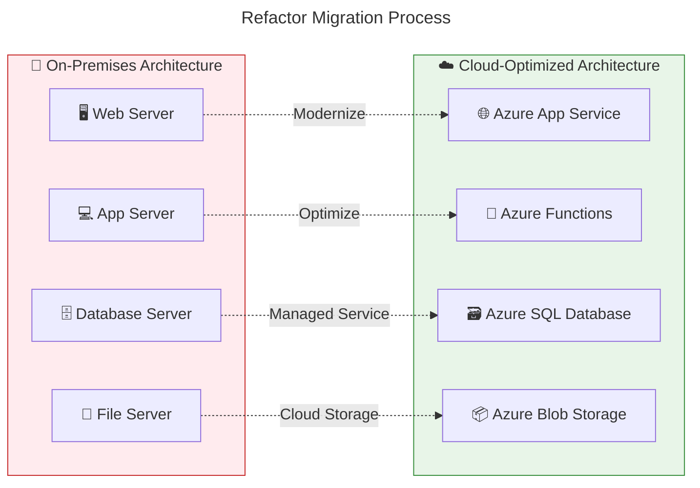
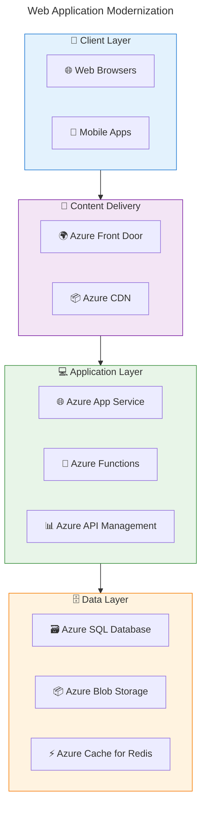
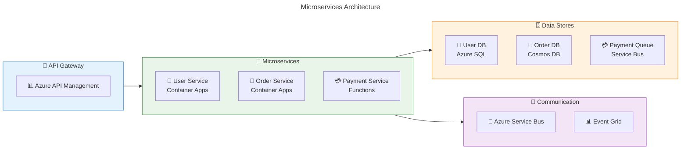
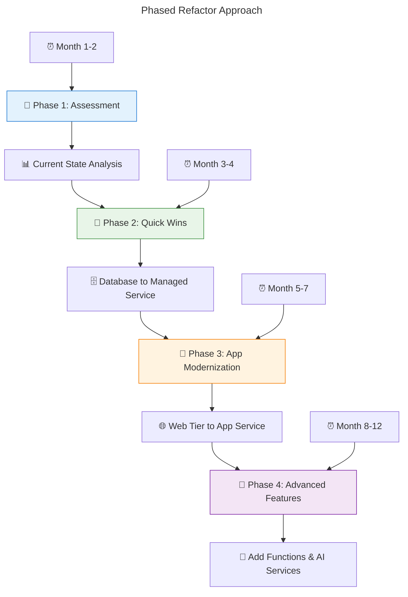
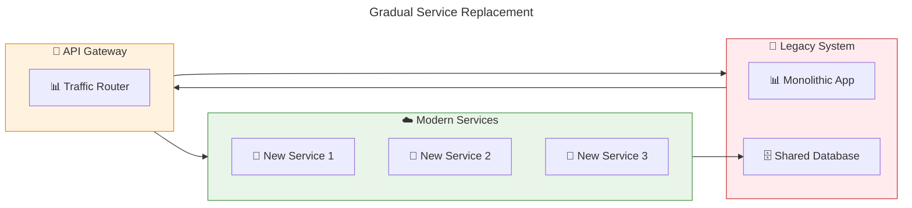
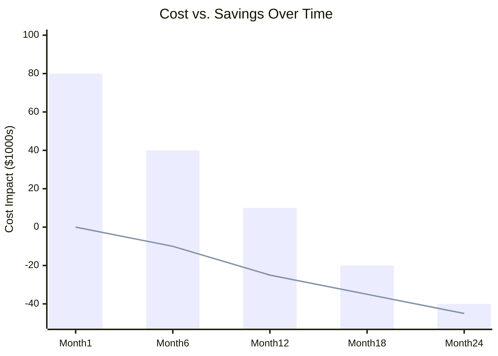
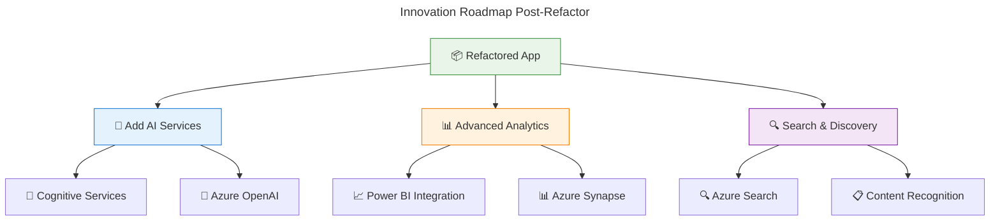

# 🔄 Refactor Strategy Overview

**Optimizing applications for cloud-native capabilities**

---

## 🎯 What is Refactor (Replatform)?

**Refactoring** involves making strategic modifications to applications to leverage cloud-native services and capabilities. Think of it as renovating your house - you keep the same foundation but upgrade systems for better efficiency, performance, and functionality.

### 🏗️ Core Concept



## ✅ Key Benefits of Refactor

### 🚀 **Performance & Scalability**
- **⚡ Auto-scaling capabilities** - handle traffic spikes automatically
- **🌍 Global distribution** - CDN and regional deployments
- **📊 Optimized performance** - cloud-native service optimizations
- **🔄 Elastic compute** - pay only for resources used

### 💰 **Cost Optimization**
- **📉 Lower operational costs** - managed services reduce overhead
- **💵 Pay-per-use pricing** - eliminate idle resource costs
- **🛠️ Reduced maintenance** - Microsoft manages infrastructure
- **📊 Better resource utilization** - cloud elasticity optimization

### 🛡️ **Enhanced Security & Reliability**
- **🔐 Built-in security features** - Azure security capabilities
- **🔄 High availability** - SLA-backed service guarantees
- **📋 Compliance ready** - pre-certified compliance frameworks
- **🔙 Automated backup & recovery** - built into managed services

### 🎯 **Operational Excellence**
- **🤖 DevOps integration** - CI/CD pipeline optimization
- **📊 Advanced monitoring** - Application Insights integration
- **🔧 Automated patching** - Microsoft handles updates
- **📈 Innovation enablement** - access to AI/ML services

## 🎯 Ideal Refactor Scenarios

### ✅ **Perfect Candidates**

#### 💻 **Modern Web Applications**
```
Examples:
├── 🌐 .NET Framework → .NET Core/Azure App Service
├── ☕ Java Spring → Azure App Service for Java
├── 🐍 Python Django → Azure App Service
└── 📱 Node.js applications → Azure Functions + App Service
```

#### 📊 **Database Modernization**
```
Scenarios:
├── 🗄️ SQL Server → Azure SQL Database
├── 🐘 PostgreSQL → Azure Database for PostgreSQL
├── 🍃 MySQL → Azure Database for MySQL
└── 📋 NoSQL → Azure Cosmos DB
```

#### 🔧 **Microservices Architecture**
```
Opportunities:
├── 🏗️ Monolith → Container Apps
├── 🔄 Event-driven → Azure Service Bus
├── 📦 APIs → Azure API Management
└── 🔍 Monitoring → Application Insights
```

## 🚫 Refactor Considerations

### ⚠️ **What Refactor Requires**

- **👨‍💻 Development expertise** - code modifications needed
- **⏰ Longer timeline** - planning and development time
- **💰 Higher upfront investment** - development and testing effort
- **🔍 Thorough testing** - ensure functionality with new services

### 🛑 **Poor Refactor Candidates**

#### ❌ **Applications to Avoid Refactoring**
```
Not Suitable for Refactor:
├── 🕰️ End-of-life legacy systems (retire instead)
├── 🔒 Highly regulated with strict change controls
├── 👥 No available development resources
└── ⏰ Extremely tight migration timelines
```

## 🏗️ Azure Refactor Architecture Patterns

### 🌐 **Web Application Refactor Pattern**



### 🔄 **Microservices Refactor Pattern**



## 📊 Refactor Service Mapping

### 🔄 **Common Refactor Transformations**

| Traditional Architecture | Azure Cloud-Native | Benefits |
|-------------------------|-------------------|----------|
| **🖥️ IIS Web Server** | Azure App Service | Auto-scaling, managed runtime |
| **⚖️ Load Balancer** | Azure Application Gateway | SSL termination, WAF |
| **🗄️ SQL Server VM** | Azure SQL Database | Managed patching, backup |
| **📁 File Shares** | Azure Blob Storage | Global CDN, lifecycle policies |
| **🔄 Scheduled Tasks** | Azure Functions | Event-driven, serverless |
| **📊 Custom Logging** | Application Insights | Advanced analytics, alerting |
| **🔐 Active Directory** | Azure AD B2C | Modern auth, social providers |

### 💻 **Application Framework Modernization**

| Legacy Framework | Modern Azure Target | Migration Effort |
|------------------|-------------------|------------------|
| **🏢 .NET Framework 4.x** | .NET 6+ on App Service | 🟡 Medium |
| **☕ Java 8 on Tomcat** | Java 17 on App Service | 🟢 Low |
| **🐍 Python 2.7** | Python 3.9+ on App Service | 🔴 High |
| **📱 Classic ASP** | .NET Core Razor Pages | 🔴 High |
| **🌐 PHP 5.x** | PHP 8+ on App Service | 🟡 Medium |

## 🎯 Refactor Implementation Approaches

### 🔄 **Incremental Refactor Strategy**



### 🎯 **Strangler Fig Pattern**



## 💰 Cost Impact Analysis

### 📊 **Investment vs. Returns**



**📈 Analysis:**
- **🔴 Investment Bar**: Development and migration costs
- **🔵 Savings Line**: Operational cost reductions

### 💵 **Cost Optimization Examples**

| Scenario | Before (Monthly) | After (Monthly) | Savings |
|----------|------------------|-----------------|---------|
| **🖥️ Web App + DB** | $2,000 (VMs) | $800 (App Service + SQL DB) | 60% |
| **📊 Background Jobs** | $1,500 (Dedicated servers) | $300 (Azure Functions) | 80% |
| **📁 File Storage** | $500 (File servers) | $100 (Blob storage) | 80% |
| **🔄 Message Queue** | $800 (Message servers) | $200 (Service Bus) | 75% |

## 🎯 Success Metrics

### 📊 **Performance Improvements**

#### ⚡ **Expected Performance Gains**
- **🚀 Response time improvement**: 30-50% faster
- **📈 Throughput increase**: 2-5x more concurrent users
- **🌍 Global performance**: CDN reduces latency by 60%
- **⏰ Availability improvement**: 99.9% → 99.95% SLA

#### 📋 **Operational Metrics**
- **🛠️ Deployment frequency**: Daily vs. monthly releases
- **🔄 Recovery time**: Minutes vs. hours
- **🐛 Bug resolution**: 50% faster with better monitoring
- **👥 Team productivity**: 30% more time on features vs. operations

### ✅ **Success Criteria Checklist**

- [ ] **⚡ Performance benchmarks** exceeded baseline by 30%
- [ ] **💰 Cost reduction** achieved within 12 months
- [ ] **🛡️ Security posture** improved with Azure features
- [ ] **📊 Monitoring & alerting** comprehensive coverage
- [ ] **🔄 Auto-scaling** working effectively
- [ ] **👥 Team adoption** of new tools and processes

## 🚀 Innovation Opportunities

### 🤖 **Advanced Azure Services Integration**



### 🎯 **Cloud-Native Capabilities**

```
Post-Refactor Enhancements:
├── 🔄 Event-driven architecture with Event Grid
├── 🤖 Serverless compute with Azure Functions
├── 📊 Real-time analytics with Stream Analytics
├── 🧠 AI/ML integration with Cognitive Services
├── 🔍 Full-text search with Azure Search
└── 🌍 Multi-region deployment for global scale
```

---

## 🎯 Key Takeaways

- **🔄 Refactor unlocks cloud-native benefits** through strategic code modifications
- **💰 Higher upfront investment** pays off with lower operational costs
- **⚡ Significant performance and scalability gains** possible
- **🛠️ Requires development expertise** and thorough testing
- **🚀 Enables innovation** with advanced Azure services
- **📊 Success measurable** through performance and cost metrics

---

**📖 Next Steps:**
- ⚙️ [Implementation Guide](./implementation.md) - Step-by-step refactor process
- 🎯 [Best Practices](./best-practices.md) - Proven modernization strategies
- 📈 [Use Cases & Examples](./use-cases.md) - Real-world refactor scenarios
