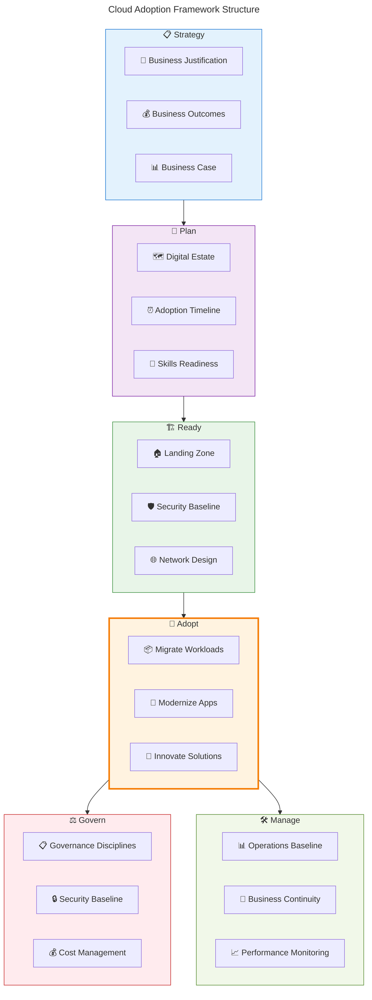
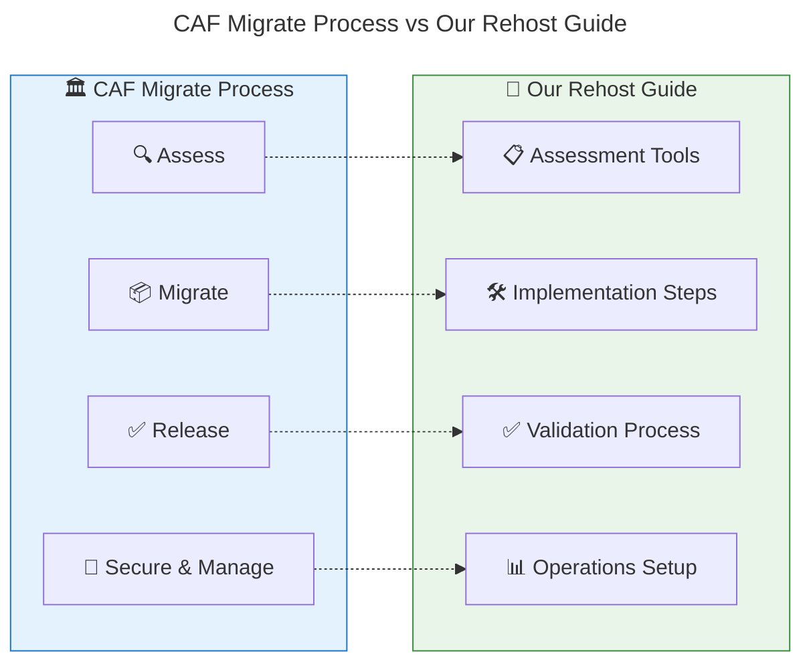
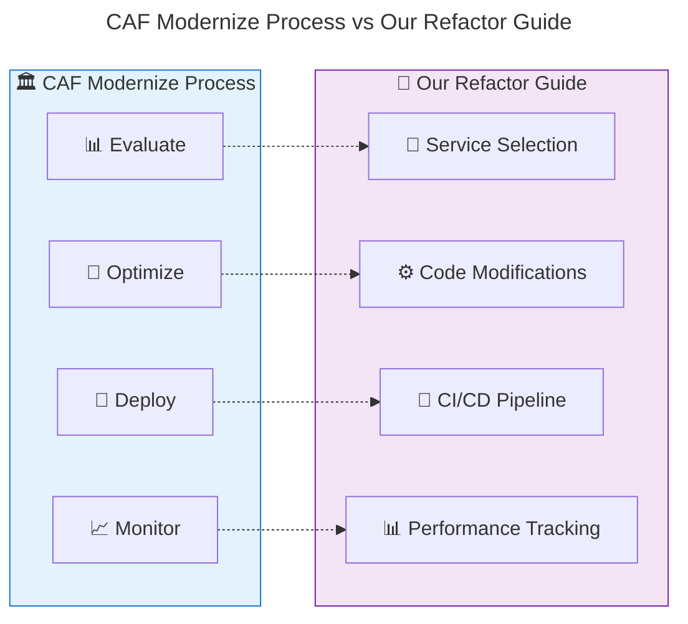
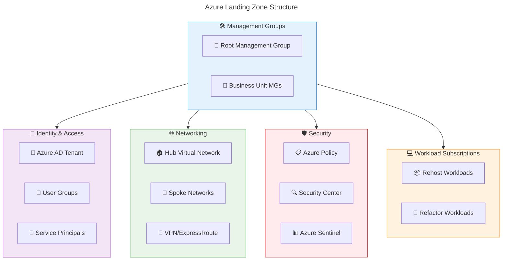
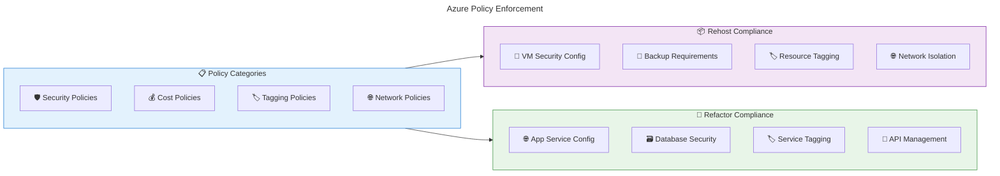
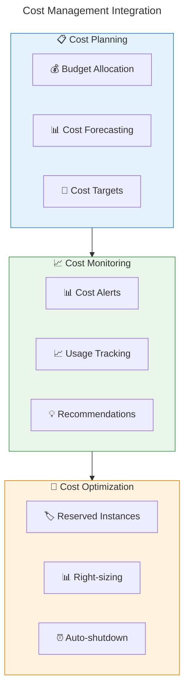
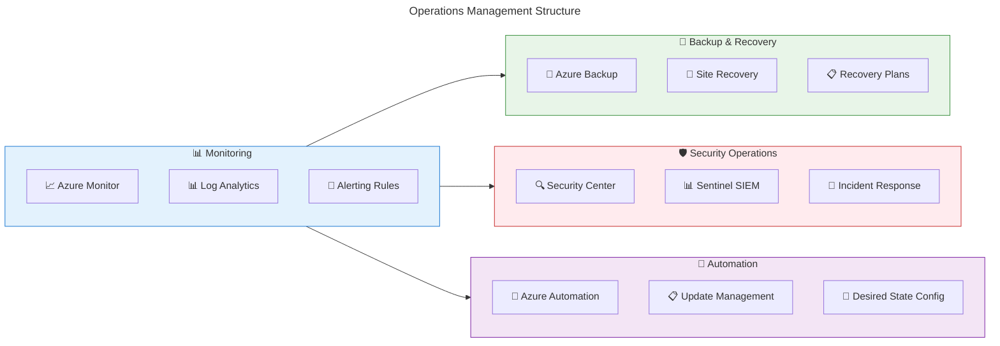
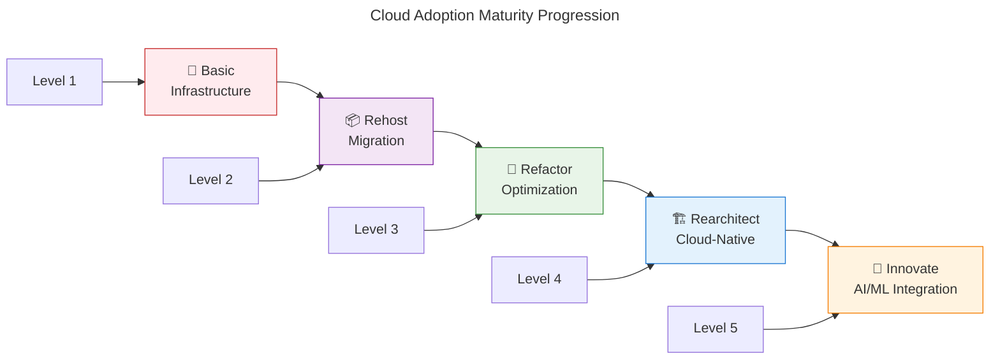

# 🏛️ Cloud Adoption Framework Alignment

**Ensuring migration strategies align with Microsoft CAF best practices**

---

## 🎯 Understanding Cloud Adoption Framework (CAF)

The **Microsoft Cloud Adoption Framework** provides proven guidance and best practices for cloud adoption. Our migration strategies (Rehost and Refactor) align directly with CAF's **Adopt methodology**.

### 🗺️ CAF Overview



## 🎯 Adopt Methodology Deep Dive

### 📦 **Migrate (Rehost) Alignment**

Our Rehost strategy directly implements CAF's **Migrate** approach:

#### ✅ **CAF Migrate Principles**
- **🚀 Minimal business logic changes** - preserve existing functionality
- **⚡ Fast time to value** - quickest path to cloud benefits
- **🛡️ Risk mitigation** - proven migration patterns
- **📊 Foundation for optimization** - platform for future improvements

#### 🎯 **Migration Process Alignment**



### 🔄 **Modernize (Refactor) Alignment**

Our Refactor strategy implements CAF's **Modernize** approach:

#### ✅ **CAF Modernize Principles**
- **☁️ Cloud-native capabilities** - leverage managed services
- **📈 Performance optimization** - improve scalability and efficiency
- **💰 Cost optimization** - reduce long-term operational costs
- **🚀 Innovation enablement** - foundation for advanced features

#### 🎯 **Modernization Process Alignment**



## 📋 CAF Design Principles Implementation

### 🏗️ **Landing Zone Design**

Both migration strategies require proper Azure Landing Zones:



### 🛡️ **Security Baseline Implementation**

| Security Area | Rehost Implementation | Refactor Implementation |
|---------------|----------------------|-------------------------|
| **🔐 Identity** | Azure AD integration | Azure AD B2C for modern auth |
| **🌐 Network** | NSGs, firewalls | App Gateway, Front Door WAF |
| **💾 Data** | Disk encryption | Transparent data encryption |
| **📊 Monitoring** | Azure Monitor for VMs | Application Insights |
| **🔒 Secrets** | Key Vault integration | Managed Identity access |

## 📊 Governance Integration

### ⚖️ **Policy Implementation**



### 🏷️ **Tagging Strategy**

Both strategies implement consistent tagging:

```
Required Tags for All Resources:
├── 🏢 BusinessUnit: [Finance, Marketing, IT]
├── 🎯 Environment: [Dev, Test, Prod]
├── 👤 Owner: [email@company.com]
├── 💰 CostCenter: [12345]
├── 📅 CreatedDate: [YYYY-MM-DD]
├── 🔄 MaintenanceWindow: [Saturday-2AM]
└── 📦 MigrationStrategy: [Rehost, Refactor]
```

## 💰 Cost Management Alignment

### 📊 **Cost Governance Framework**



### 💵 **Cost Optimization by Strategy**

| Optimization Area | Rehost Approach | Refactor Approach |
|------------------|-----------------|-------------------|
| **🖥️ Compute** | VM Reserved Instances | App Service Plans |
| **💾 Storage** | Storage tier optimization | Blob lifecycle policies |
| **🌐 Network** | VPN vs ExpressRoute | CDN optimization |
| **🗄️ Database** | SQL VM optimization | Managed database tiers |
| **📊 Monitoring** | Basic VM monitoring | Application-level insights |

## 🛠️ Operations Management

### 📊 **Operations Baseline**



### 📋 **Operations Checklist by Strategy**

#### 📦 **Rehost Operations**
- [ ] **🖥️ VM monitoring** and alerting configured
- [ ] **💾 Backup policies** for all VMs and data
- [ ] **🔄 Update management** for OS patching
- [ ] **🛡️ Security monitoring** for infrastructure
- [ ] **📊 Performance baselines** established
- [ ] **🎯 Disaster recovery** plans tested

#### 🔄 **Refactor Operations**
- [ ] **📊 Application Insights** monitoring enabled
- [ ] **🔄 Automated deployments** via CI/CD
- [ ] **📈 Auto-scaling** rules configured
- [ ] **🛡️ Security scanning** in pipeline
- [ ] **📊 Performance testing** automated
- [ ] **🎯 Blue-green deployments** capability

## 📈 Success Metrics & KPIs

### 🎯 **CAF-Aligned Success Measures**

| CAF Area | Key Metrics | Rehost Targets | Refactor Targets |
|----------|-------------|----------------|------------------|
| **💰 Financial** | Cost optimization | 20-30% reduction | 40-60% reduction |
| **⚡ Performance** | Response time | Maintain baseline | 30-50% improvement |
| **🛡️ Security** | Security incidents | Reduce by 50% | Reduce by 70% |
| **🔄 Operational** | MTTR | Improve by 30% | Improve by 60% |
| **📊 Business** | Time to market | Maintain current | Improve by 40% |

### 📊 **Maturity Assessment**



## 📚 CAF Resources Integration

### 🔗 **Essential CAF Documentation**

- **📖 [Cloud Adoption Framework](https://docs.microsoft.com/azure/cloud-adoption-framework/)** - Complete framework overview
- **🏗️ [Landing Zone Design](https://docs.microsoft.com/azure/cloud-adoption-framework/ready/landing-zone/)** - Infrastructure foundation
- **📦 [Migrate Methodology](https://docs.microsoft.com/azure/cloud-adoption-framework/migrate/)** - Migration guidance
- **🔄 [Modernize Guidance](https://docs.microsoft.com/azure/cloud-adoption-framework/modernize/)** - Application modernization
- **⚖️ [Governance Framework](https://docs.microsoft.com/azure/cloud-adoption-framework/govern/)** - Governance implementation

### 🛠️ **CAF Tools Integration**

| Tool Category | CAF Tool | Our Implementation |
|---------------|----------|-------------------|
| **📊 Assessment** | Azure Migrate | Workload discovery and planning |
| **🏗️ Architecture** | Azure Architecture Center | Reference architectures |
| **⚖️ Governance** | Azure Policy | Compliance enforcement |
| **💰 Cost** | Azure Cost Management | Budget and optimization |
| **🛡️ Security** | Azure Security Center | Security monitoring |

---

## 🎯 Key Takeaways

- **🏛️ CAF provides proven framework** for structured cloud adoption
- **📦 Rehost aligns with CAF Migrate** methodology for fast cloud entry
- **🔄 Refactor implements CAF Modernize** approach for optimization
- **🛡️ Both strategies require** proper landing zone foundation
- **⚖️ Governance and operations** are critical for long-term success
- **📊 Success measurement** should align with CAF KPIs

---

**📖 Next Steps:**
- 🏗️ [Well-Architected Framework](./waf-alignment.md) - Technical excellence principles
- 📐 [Design Principles](./design-principles.md) - Architectural best practices
- 🔧 [Implementation Guides](../02-rehost/implementation.md) - Apply CAF in practice
