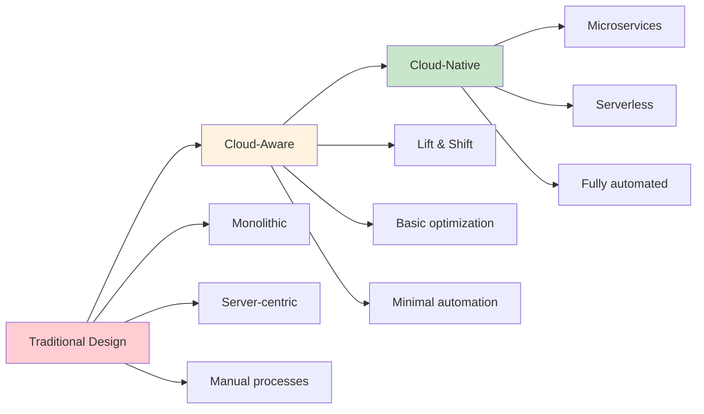
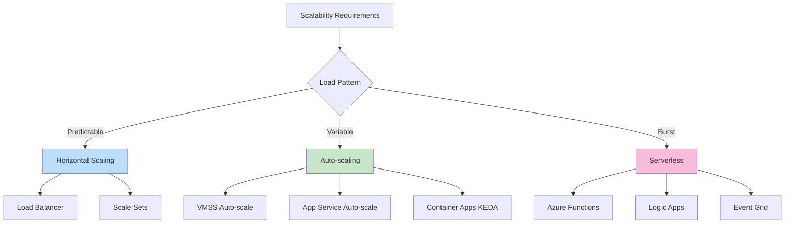
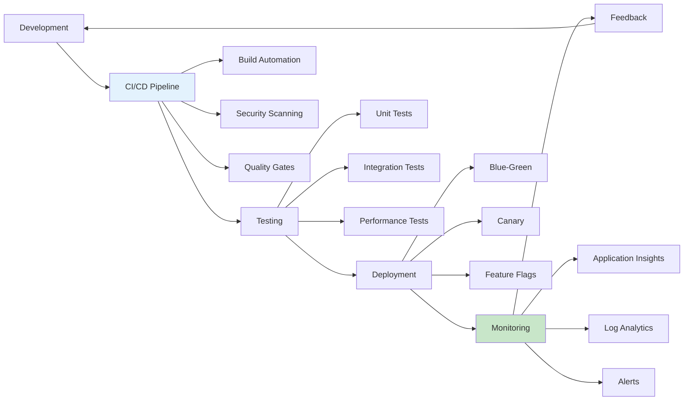
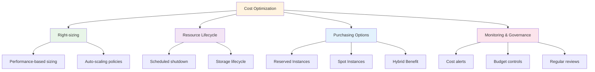
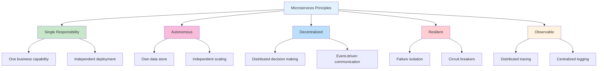
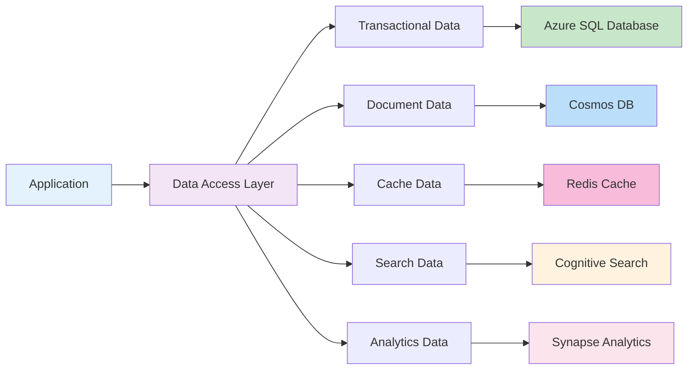
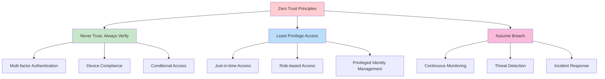
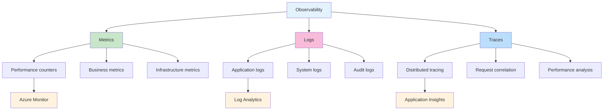
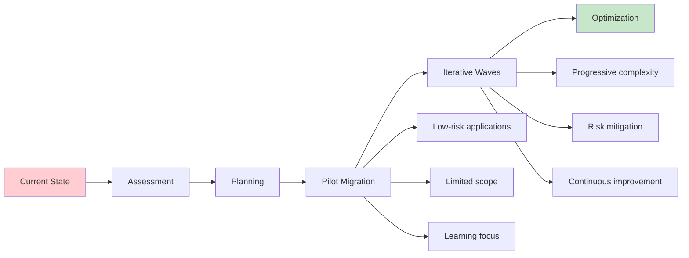

# 🎯 Design Principles for Azure Migration

**Core principles and architectural guidelines for successful Azure migration**

---

## 🏗️ Overview

This document outlines fundamental design principles that guide successful Azure migration projects, ensuring scalable, secure, and maintainable cloud solutions aligned with industry best practices.

## 🌟 Core Design Principles

### 1. 🔄 Cloud-Native First

**Principle**: Design for cloud-native capabilities from the start



#### **Implementation Guidelines**

| **Aspect** | **Traditional** | **Cloud-Native** | **Benefits** |
|------------|----------------|------------------|--------------|
| 🏗️ **Architecture** | Monolithic | Microservices/Serverless | Scalability, maintainability |
| 💾 **Data** | Single database | Polyglot persistence | Performance, flexibility |
| 🔄 **Communication** | Synchronous | Event-driven | Resilience, decoupling |
| 📊 **State** | Stateful | Stateless | Scalability, reliability |

### 2. 🛡️ Security by Design

**Principle**: Integrate security at every layer and stage

#### **Security Architecture Layers**

```mermaid
pyramid
    title Security Architecture
    
    "Application Security" : 20
    "Data Protection" : 25
    "Network Security" : 30
    "Identity & Access" : 35
    "Infrastructure Security" : 40
```

#### **Security Implementation Framework**

| **Layer** | **Controls** | **Azure Services** | **Implementation** |
|-----------|--------------|-------------------|-------------------|
| 🔐 **Identity** | Authentication, Authorization | Azure AD, B2C | Zero Trust model |
| 🌐 **Network** | Segmentation, Filtering | NSG, Firewall, Front Door | Defense in depth |
| 💾 **Data** | Encryption, Masking | Key Vault, Always Encrypted | Data classification |
| 📱 **Application** | Code security, OWASP | Security Center, Defender | Secure SDLC |

### 3. ⚡ Performance & Scalability

**Principle**: Design for elastic scale and optimal performance

#### **Scalability Patterns**



#### **Performance Optimization Guidelines**

| **Component** | **Optimization Strategy** | **Target Metrics** |
|---------------|---------------------------|-------------------|
| 🌐 **Frontend** | CDN, caching, compression | <3s page load |
| ⚙️ **API** | Connection pooling, async patterns | <500ms response |
| 💾 **Database** | Indexing, partitioning, read replicas | <100ms queries |
| 📡 **Network** | Regional deployment, ExpressRoute | <50ms latency |

### 4. 🔄 Operational Excellence

**Principle**: Automate operations and enable continuous improvement

#### **DevOps Integration Model**



#### **Operational Capabilities**

| **Capability** | **Implementation** | **Tools** | **Benefits** |
|----------------|-------------------|-----------|--------------|
| 🤖 **Automation** | IaC, deployment pipelines | ARM, Bicep, Terraform | Consistency, speed |
| 📊 **Monitoring** | APM, infrastructure monitoring | Application Insights, Monitor | Proactive issue detection |
| 🚨 **Alerting** | Intelligent alerts, runbooks | Logic Apps, Monitor | Rapid response |
| 📈 **Analytics** | Performance insights, trends | Log Analytics, Workbooks | Continuous improvement |

### 5. 💰 Cost Optimization

**Principle**: Optimize for cost without compromising quality

#### **Cost Optimization Framework**



#### **Cost Control Strategies**

| **Strategy** | **Implementation** | **Savings Potential** |
|--------------|-------------------|----------------------|
| 🎛️ **Right-sizing** | Monitor utilization, adjust resources | 20-50% |
| 🕒 **Scheduling** | Auto-shutdown dev/test environments | 30-60% |
| 💾 **Storage Tiering** | Lifecycle policies, appropriate tiers | 40-70% |
| 🏷️ **Reserved Capacity** | 1-3 year commitments | 30-60% |

## 🏗️ Architectural Patterns

### 📱 Application Architecture Patterns

#### **Microservices Design Principles**



#### **Event-Driven Architecture**

| **Pattern** | **Use Case** | **Azure Implementation** |
|-------------|--------------|-------------------------|
| 🔔 **Event Notification** | State change notifications | Event Grid |
| 🌊 **Event Streaming** | Continuous data flows | Event Hubs |
| 📋 **Event Sourcing** | Audit trails, replay capability | Cosmos DB Change Feed |
| 🎯 **CQRS** | Read/write optimization | Separate read/write stores |

### 💾 Data Architecture Patterns

#### **Polyglot Persistence Strategy**



#### **Data Consistency Patterns**

| **Pattern** | **Consistency Level** | **Use Case** | **Trade-offs** |
|-------------|----------------------|--------------|----------------|
| 🔒 **Strong Consistency** | ACID compliance | Financial transactions | Lower availability |
| 🔄 **Eventual Consistency** | Eventually consistent | Social media feeds | Higher availability |
| 📊 **Session Consistency** | Consistent within session | Shopping carts | Balanced approach |
| 🏷️ **Bounded Staleness** | Configurable lag | Global applications | Flexible consistency |

## 🛡️ Security Design Patterns

### 🔐 Zero Trust Architecture

#### **Zero Trust Implementation**



### 🔑 Identity and Access Management

#### **IAM Design Principles**

| **Principle** | **Implementation** | **Azure Services** |
|---------------|-------------------|-------------------|
| 🎯 **Single Sign-On** | Federated identity | Azure AD |
| 🔐 **Multi-Factor Authentication** | Additional verification | Azure MFA |
| 🏷️ **Role-Based Access** | Principle of least privilege | Azure RBAC |
| ⏰ **Just-in-Time Access** | Temporary elevated access | PIM |

## 📊 Monitoring & Observability

### 📈 Observability Strategy

#### **Three Pillars of Observability**



#### **Monitoring Implementation Strategy**

| **Component** | **Metrics** | **Monitoring Tool** | **Alerting** |
|---------------|-------------|-------------------|--------------|
| 🌐 **Application** | Response time, throughput | Application Insights | Smart detection |
| 🖥️ **Infrastructure** | CPU, memory, disk | Azure Monitor | Metric alerts |
| 💾 **Database** | DTU, connections, latency | SQL Analytics | Query performance |
| 🔒 **Security** | Failed logins, anomalies | Security Center | Security alerts |

## 🚀 Migration-Specific Principles

### 🎯 Migration Strategy Principles

#### **Incremental Migration Approach**



#### **Risk Mitigation Strategies**

| **Risk Type** | **Mitigation Strategy** | **Implementation** |
|---------------|------------------------|-------------------|
| 🕒 **Downtime** | Blue-green deployment | Parallel environments |
| 💾 **Data Loss** | Backup and validation | Multi-layer backups |
| ⚡ **Performance** | Load testing | Pre-migration testing |
| 🔒 **Security** | Security validation | Penetration testing |

## 📚 Best Practices Summary

### ✅ Design Checklist

#### **Architecture Review Checklist**

- [ ] **🏗️ Scalability**: Can the system handle increased load?
- [ ] **🛡️ Security**: Are security controls implemented at every layer?
- [ ] **⚡ Performance**: Are performance requirements met?
- [ ] **💰 Cost**: Is the solution cost-optimized?
- [ ] **🔄 Reliability**: Can the system recover from failures?
- [ ] **📊 Observability**: Can you monitor and troubleshoot effectively?
- [ ] **🚀 Maintainability**: Is the solution easy to maintain and update?

#### **Migration Readiness Checklist**

- [ ] **📋 Assessment Complete**: All dependencies and requirements identified
- [ ] **🎯 Strategy Defined**: Clear migration approach selected
- [ ] **🛠️ Tools Configured**: Migration tools set up and tested
- [ ] **👥 Team Prepared**: Team trained and roles defined
- [ ] **📊 Monitoring Ready**: Observability tools configured
- [ ] **🔄 Rollback Plan**: Rollback procedures documented and tested

---

### 🔗 Related Resources

- 📖 [CAF Design Principles](caf-alignment.md#design-principles)
- 🏗️ [Well-Architected Framework](waf-alignment.md)
- 🛠️ [Implementation Guides](../02-rehost/implementation.md)
- 📊 [Assessment Tools](../05-tools/assessment-tools.md)

---

**📅 Last Updated**: May 2025  
**👥 Contributors**: Cloud Architecture Team  
**🔄 Review Cycle**: Quarterly
