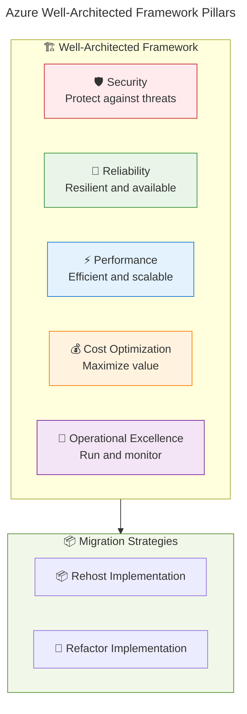
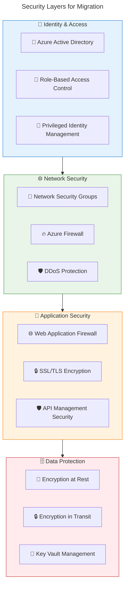
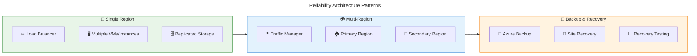
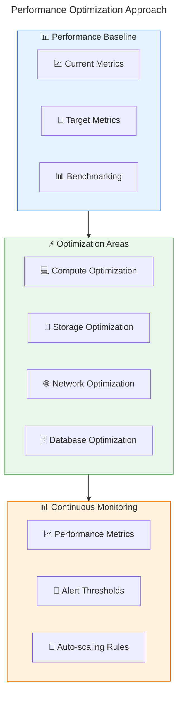
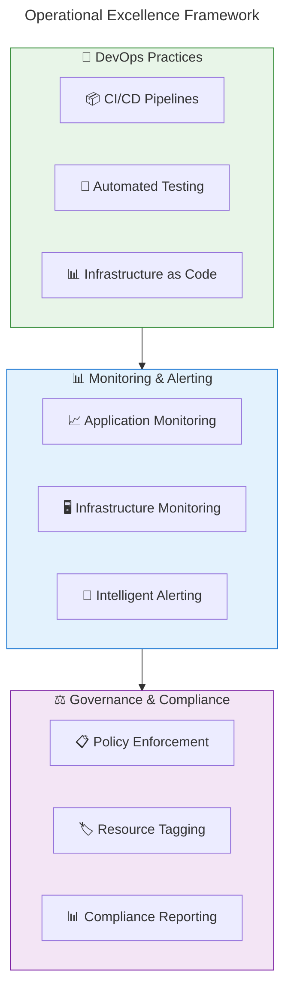
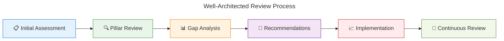

# 🏗️ Well-Architected Framework Alignment

**Ensuring migration strategies follow Azure WAF best practices**

---

## 🎯 Understanding Well-Architected Framework (WAF)

The **Azure Well-Architected Framework** provides architectural guidance based on five key pillars. Both Rehost and Refactor strategies must align with these pillars to ensure successful, sustainable cloud solutions.

### 🏛️ The Five Pillars



## 🛡️ Security Pillar Implementation

### 🔐 **Defense in Depth Strategy**

Both migration strategies implement layered security:



### 🔒 **Security by Migration Strategy**

| Security Aspect | Rehost Approach | Refactor Approach |
|-----------------|-----------------|-------------------|
| **🔐 Identity** | Azure AD Connect | Azure AD B2C integration |
| **🌐 Network** | NSGs, VPN Gateway | App Gateway, Front Door |
| **📱 Application** | VM-level security | WAF, API Management |
| **🗄️ Data** | Disk encryption | TDE, Always Encrypted |
| **🔑 Secrets** | Key Vault basic | Managed Identity access |
| **📊 Monitoring** | Security Center | Advanced Threat Protection |

### ✅ **Security Checklist**

#### 📦 **Rehost Security Requirements**
- [ ] **🔐 Azure AD integration** configured
- [ ] **🌐 Network segmentation** implemented
- [ ] **💾 Disk encryption** enabled
- [ ] **🔑 Key Vault** for secrets management
- [ ] **📊 Security monitoring** enabled
- [ ] **🔄 Backup encryption** configured
- [ ] **🛡️ Antimalware** protection active

#### 🔄 **Refactor Security Requirements**
- [ ] **🔐 Managed Identity** for service authentication
- [ ] **🌐 WAF protection** for web applications
- [ ] **🗃️ Database security** features enabled
- [ ] **🔒 API security** with OAuth/OpenID
- [ ] **📊 Application security** monitoring
- [ ] **🔐 Container security** if using containers
- [ ] **🛡️ DevSecOps** pipeline integration

## 🔄 Reliability Pillar Implementation

### 🎯 **Availability and Resilience**



### 📊 **Reliability Targets by Strategy**

| Reliability Metric | Rehost Target | Refactor Target |
|--------------------|---------------|-----------------|
| **⏰ Availability SLA** | 99.9% (VM SLA) | 99.95% (PaaS SLA) |
| **🔄 Recovery Time (RTO)** | 4-8 hours | 1-2 hours |
| **💾 Recovery Point (RPO)** | 1 hour | 15 minutes |
| **🌍 Multi-region** | Manual failover | Automated failover |
| **📊 Health monitoring** | Basic VM metrics | Application-level health |

### 🛠️ **Reliability Implementation**

#### 📦 **Rehost Reliability Features**
```
Infrastructure Reliability:
├── 🔄 Availability Sets for VM placement
├── ⚖️ Load Balancer for traffic distribution
├── 💾 Azure Backup for data protection
├── 🔄 Azure Site Recovery for DR
├── 📊 Azure Monitor for health checks
└── 🚨 Alert rules for proactive monitoring
```

#### 🔄 **Refactor Reliability Features**
```
Platform Reliability:
├── 🌐 App Service multi-instance deployment
├── 🔄 Auto-scaling based on demand
├── 🗃️ Database automatic failover
├── 🌍 Multi-region deployment capability
├── 📊 Application Insights health monitoring
└── 🔄 Blue-green deployment strategies
```

## ⚡ Performance Efficiency Pillar

### 🚀 **Performance Optimization Strategy**



### 📈 **Performance Comparison**

| Performance Area | On-Premises Baseline | Rehost Performance | Refactor Performance |
|------------------|---------------------|-------------------|---------------------|
| **🚀 Response Time** | 500ms | 450ms (10% better) | 300ms (40% better) |
| **📊 Throughput** | 1000 req/min | 1200 req/min | 2500 req/min |
| **💾 Storage IOPS** | 1000 IOPS | 3000 IOPS (Premium) | Unlimited (managed) |
| **🌍 Global Latency** | N/A | VPN dependent | CDN optimized |
| **📈 Scalability** | Manual | Manual VM scaling | Auto-scaling |

### 🎯 **Performance Best Practices**

#### 📦 **Rehost Performance Optimization**
- **🖥️ Right-size VMs** based on actual usage patterns
- **💾 Use Premium SSD** for performance-critical workloads
- **🌐 Enable accelerated networking** for network-intensive apps
- **📊 Implement caching** with Azure Cache for Redis
- **⚖️ Configure load balancing** for traffic distribution

#### 🔄 **Refactor Performance Benefits**
- **🔄 Auto-scaling** responds to demand automatically
- **🌍 CDN integration** reduces global latency
- **🗃️ Managed database** optimization and tuning
- **📊 Application-level monitoring** for bottleneck identification
- **🚀 Serverless compute** for event-driven workloads

## 💰 Cost Optimization Pillar

### 📊 **Cost Management Strategy**

```mermaid
---
title: Cost Optimization Framework
---
flowchart LR
    subgraph Planning [📋 Cost Planning]
        A[💰 Budget Setting]
        B[📊 Cost Forecasting]
        C[🎯 Cost Allocation]
    end
    
    subgraph Monitoring [📈 Cost Monitoring]
        D[📊 Usage Tracking]
        E[🚨 Budget Alerts]
        F[📈 Cost Analysis]
    end
    
    subgraph Optimization [🔧 Cost Optimization]
        G[🏷️ Reserved Instances]
        H[📊 Right-sizing]
        I[⏰ Resource Scheduling]
        J[🗄️ Storage Optimization]
    end
    
    Planning --> Monitoring --> Optimization
    
    style Planning fill:#e3f2fd,stroke:#1976d2
    style Monitoring fill:#e8f5e8,stroke:#388e3c
    style Optimization fill:#fff3e0,stroke:#f57c00
```



### 💵 **Cost Comparison Analysis**

| Cost Category | On-Premises Annual | Rehost Annual | Refactor Annual |
|---------------|-------------------|---------------|-----------------|
| **🖥️ Compute** | $120,000 | $80,000 | $50,000 |
| **💾 Storage** | $30,000 | $25,000 | $15,000 |
| **🌐 Network** | $20,000 | $15,000 | $10,000 |
| **👥 Operations** | $80,000 | $60,000 | $30,000 |
| **🛡️ Security** | $25,000 | $15,000 | $10,000 |
| **📊 Total** | **$275,000** | **$195,000** | **$115,000** |
| **💰 Savings** | Baseline | **29% savings** | **58% savings** |

### 🎯 **Cost Optimization Strategies**

#### 📦 **Rehost Cost Optimization**
```
Immediate Savings:
├── 🏷️ Azure Reserved Instances (30-70% savings)
├── 📊 VM right-sizing based on metrics
├── ⏰ Auto-shutdown for dev/test environments
├── 💾 Storage tier optimization (hot/cool/archive)
├── 🌐 Bandwidth optimization
└── 🔄 Backup policy optimization
```

#### 🔄 **Refactor Cost Benefits**
```
Long-term Savings:
├── 🌐 PaaS pricing models (pay-per-use)
├── 🔄 Auto-scaling reduces idle costs
├── 🛠️ Reduced operational overhead
├── 📊 Managed service efficiency
├── 🚀 Serverless compute for sporadic workloads
└── 🌍 Global optimization through CDN
```

## 🎯 Operational Excellence Pillar

### 🛠️ **Operations Management**



### 📊 **Operational Maturity by Strategy**

| Operational Area | Rehost Maturity | Refactor Maturity |
|------------------|-----------------|-------------------|
| **🔄 Deployment** | Manual/scripted | Fully automated CI/CD |
| **📊 Monitoring** | Infrastructure-focused | Application-aware |
| **🚨 Alerting** | Reactive | Predictive analytics |
| **🛠️ Maintenance** | Manual patching | Automated updates |
| **📋 Documentation** | Traditional docs | Living documentation |
| **🧪 Testing** | Manual testing | Automated test suites |

### ✅ **Operational Excellence Checklist**

#### 📦 **Rehost Operations**
- [ ] **🔄 Backup automation** configured and tested
- [ ] **📊 Monitoring dashboards** for infrastructure
- [ ] **🚨 Alert rules** for critical thresholds
- [ ] **🛠️ Patch management** strategy implemented
- [ ] **📋 Runbooks** for common operations
- [ ] **🧪 Disaster recovery** testing scheduled

#### 🔄 **Refactor Operations**
- [ ] **🔄 CI/CD pipelines** for automated deployment
- [ ] **📊 Application Insights** comprehensive monitoring
- [ ] **🚨 Smart alerting** with ML-based anomaly detection
- [ ] **🛠️ Auto-scaling** rules and policies
- [ ] **📋 Infrastructure as Code** for repeatability
- [ ] **🧪 Blue-green deployments** for zero-downtime

## 📈 WAF Assessment & Scoring

### 🎯 **WAF Review Process**



### 📊 **WAF Scoring Matrix**

| Pillar | Weight | Rehost Score | Refactor Score |
|--------|--------|--------------|----------------|
| **🛡️ Security** | 25% | 7/10 | 9/10 |
| **🔄 Reliability** | 20% | 6/10 | 8/10 |
| **⚡ Performance** | 20% | 6/10 | 9/10 |
| **💰 Cost Optimization** | 20% | 8/10 | 9/10 |
| **🎯 Operational Excellence** | 15% | 5/10 | 8/10 |
| **📊 Overall Score** | 100% | **6.4/10** | **8.6/10** |

### 🎯 **Improvement Recommendations**

#### 📦 **Rehost WAF Improvements**
```
Priority Improvements:
├── 🎯 Implement automated deployment processes
├── 📊 Enhance application-level monitoring
├── 🔄 Add auto-scaling capabilities
├── 🛡️ Strengthen identity management
└── 🧪 Implement automated testing
```

#### 🔄 **Refactor WAF Excellence**
```
Advanced Optimizations:
├── 🌍 Multi-region deployment strategy
├── 🤖 AI-powered monitoring and alerting
├── 🔐 Zero-trust security model
├── 📊 Advanced cost optimization algorithms
└── 🚀 Chaos engineering practices
```

---

## 🎯 Key Takeaways

- **🏗️ WAF provides technical excellence** framework for both strategies
- **📦 Rehost achieves good baseline** across all pillars
- **🔄 Refactor enables higher WAF scores** through cloud-native features
- **📊 Continuous assessment** ensures ongoing optimization
- **🎯 Both strategies can achieve** WAF compliance with proper implementation
- **📈 Success measurement** should include WAF scoring

---

**📖 Next Steps:**
- 📐 [Design Principles](./design-principles.md) - Architectural best practices
- 🔧 [Implementation Guides](../02-rehost/implementation.md) - Apply WAF principles
- 🛠️ [Migration Tools](../05-tools/migration-tools.md) - WAF-aligned tooling
