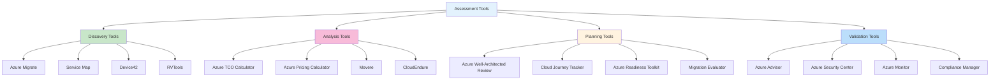
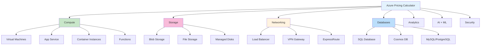
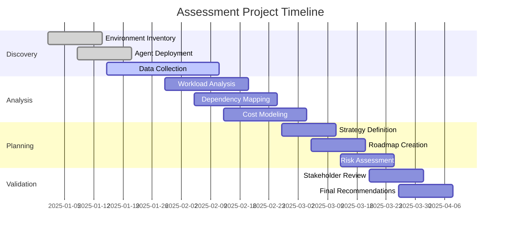
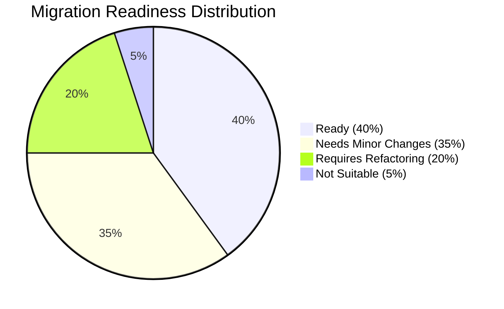

# 🔍 Assessment Tools Guide

**Comprehensive guide to Azure migration assessment tools and methodologies**

---

## 🎯 Overview

This guide provides detailed information about assessment tools that help evaluate your current environment, plan migration strategies, and estimate costs for Azure migration projects.

## 📊 Assessment Tool Ecosystem

### 🔍 Tool Classification



## 🔍 Primary Assessment Tools

### 🎯 Azure Migrate

**Comprehensive discovery and assessment platform**

#### **Core Assessment Capabilities**

| **Assessment Type** | **Purpose** | **Output** | **Timeline** |
|-------------------|-------------|------------|--------------|
| 🖥️ **Server Assessment** | VM sizing and cost estimation | Right-sized Azure VMs | 1-2 weeks |
| 🌐 **Web App Assessment** | App Service compatibility | Migration readiness | 3-5 days |
| 🗄️ **SQL Assessment** | Database compatibility | SQL Database/MI recommendations | 1 week |
| 📊 **AVS Assessment** | VMware on Azure sizing | AVS node requirements | 1 week |

#### **Azure Migrate Appliance Setup**

```powershell
# Download and configure Azure Migrate appliance
# For VMware environment

# 1. Download OVA template from Azure portal
# 2. Deploy in VMware environment
# 3. Configure appliance settings

# PowerShell configuration script
$applianceConfig = @{
    CloudEnvironment = "AzureCloud"
    SubscriptionId = "your-subscription-id"
    ResourceGroupName = "rg-azure-migrate"
    ProjectName = "contoso-migration-project"
    ApplianceName = "ContosomigrateAppliance"
    Region = "EastUS"
}

# Register appliance
Register-AzMigrateAppliance @applianceConfig

# Start discovery
Start-AzMigrateDiscovery -ProjectName $applianceConfig.ProjectName -ApplianceName $applianceConfig.ApplianceName
```

#### **Assessment Configuration**

```json
{
  "assessmentSettings": {
    "assessmentName": "Contoso-VM-Assessment",
    "azureLocation": "East US",
    "pricingTier": "Standard",
    "currency": "USD",
    "discountPercentage": 10,
    "azureHybridBenefit": true,
    "azureOfferCode": "MS-AZR-0148P",
    "sizingCriterion": "PerformanceBased",
    "performanceHistory": "Month",
    "percentileUtilization": "95th",
    "comfortFactor": 1.3,
    "vmUptime": {
      "daysPerMonth": 31,
      "hoursPerDay": 24
    },
    "reservedInstances": "ThreeYear"
  }
}
```

### 💰 Azure Total Cost of Ownership (TCO) Calculator

**High-level cost estimation for business cases**

#### **Input Categories & Best Practices**

| **Category** | **Data Sources** | **Accuracy Tips** |
|--------------|------------------|-------------------|
| 🖥️ **Servers** | CMDB, monitoring tools | Include all server types |
| 🗄️ **Databases** | Database inventory | Consider licensing costs |
| 💾 **Storage** | Storage management tools | Account for growth patterns |
| 🌐 **Networking** | Network monitoring | Include bandwidth costs |

#### **TCO Analysis Methodology**

```yaml
# TCO Calculator Methodology
phase1_discovery:
  duration: "2-4 weeks"
  activities:
    - inventory_collection
    - utilization_analysis
    - dependency_mapping
  
phase2_analysis:
  duration: "1-2 weeks"
  activities:
    - workload_categorization
    - cost_modeling
    - scenario_analysis
    
phase3_validation:
  duration: "1 week"
  activities:
    - stakeholder_review
    - assumption_validation
    - final_calculations

assumptions:
  server_utilization: 65%
  storage_growth_rate: 20%
  network_utilization: 40%
  discount_rate: 10%
  migration_timeline: 12_months
```

#### **Sample TCO Calculation**

```python
# Python script for TCO calculation validation
class TCOCalculator:
    def __init__(self, servers, databases, storage, networking):
        self.servers = servers
        self.databases = databases
        self.storage = storage
        self.networking = networking
    
    def calculate_current_costs(self):
        """Calculate current on-premises costs"""
        server_costs = sum([s['hardware_cost'] + s['maintenance_cost'] + s['power_cost'] 
                           for s in self.servers])
        db_costs = sum([d['license_cost'] + d['maintenance_cost'] 
                       for d in self.databases])
        storage_costs = sum([st['hardware_cost'] + st['maintenance_cost'] 
                            for st in self.storage])
        network_costs = self.networking['equipment_cost'] + self.networking['bandwidth_cost']
        
        return {
            'servers': server_costs,
            'databases': db_costs,
            'storage': storage_costs,
            'networking': network_costs,
            'total': server_costs + db_costs + storage_costs + network_costs
        }
    
    def calculate_azure_costs(self, azure_pricing):
        """Calculate Azure costs with optimizations"""
        vm_costs = sum([p['vm_cost'] * (1 - p.get('hybrid_benefit', 0)) * p.get('reserved_discount', 1)
                       for p in azure_pricing['vms']])
        sql_costs = sum([p['sql_cost'] * p.get('reserved_discount', 1)
                        for p in azure_pricing['databases']])
        storage_costs = sum([p['storage_cost'] for p in azure_pricing['storage']])
        
        return {
            'compute': vm_costs,
            'databases': sql_costs,
            'storage': storage_costs,
            'total': vm_costs + sql_costs + storage_costs
        }

# Example usage
tco = TCOCalculator(servers_data, db_data, storage_data, network_data)
current_costs = tco.calculate_current_costs()
azure_costs = tco.calculate_azure_costs(azure_pricing_data)
savings = current_costs['total'] - azure_costs['total']
roi_percentage = (savings / current_costs['total']) * 100
```

## 🔬 Specialized Assessment Tools

### 📊 Azure Pricing Calculator

**Detailed Azure service cost estimation**

#### **Calculator Categories**



#### **Pricing Estimation Best Practices**

| **Service Category** | **Key Considerations** | **Cost Optimization** |
|---------------------|----------------------|----------------------|
| 🖥️ **Compute** | Right-sizing, utilization patterns | Reserved instances, spot instances |
| 💾 **Storage** | Access patterns, redundancy needs | Lifecycle policies, tiering |
| 🌐 **Networking** | Data transfer volumes | Regional placement, CDN |
| 🗄️ **Databases** | Performance requirements | Reserved capacity, read replicas |

### 🔍 Service Map

**Application dependency discovery**

#### **Service Map Capabilities**

```json
{
  "serviceMapFeatures": {
    "automaticDiscovery": {
      "processes": true,
      "connections": true,
      "dependencies": true,
      "ports": true
    },
    "timeRanges": ["1hour", "24hours", "7days", "30days"],
    "visualizations": {
      "machineView": "Server-centric dependency view",
      "processView": "Process-level dependencies",
      "groupView": "Logical application grouping"
    },
    "integrations": {
      "azureMigrate": true,
      "logAnalytics": true,
      "securityCenter": true,
      "monitor": true
    }
  }
}
```

#### **Dependency Analysis Workflow**

```powershell
# Service Map analysis workflow
# 1. Deploy Log Analytics agent
$workspaceName = "log-analytics-migration"
$resourceGroup = "rg-migration-assessment"

# Create Log Analytics workspace
$workspace = New-AzOperationalInsightsWorkspace -ResourceGroupName $resourceGroup -Name $workspaceName -Location "EastUS"

# Enable Service Map solution
Set-AzOperationalInsightsIntelligencePack -ResourceGroupName $resourceGroup -WorkspaceName $workspaceName -IntelligencePackName "ServiceMap" -Enabled $true

# Query for dependencies
$query = @"
VMConnection
| where TimeGenerated > ago(7d)
| where Computer == "web-server-01"
| summarize by SourceIp, DestinationIp, DestinationPort, Protocol
| order by DestinationPort
"@

$results = Invoke-AzOperationalInsightsQuery -WorkspaceId $workspace.CustomerId -Query $query
```

## 📋 Assessment Methodologies

### 🎯 Comprehensive Assessment Framework

#### **Assessment Phases**



#### **Assessment Checklist**

| **Phase** | **Deliverable** | **Tools** | **Timeline** |
|-----------|----------------|-----------|--------------|
| 🔍 **Discovery** | Infrastructure inventory | Azure Migrate, RVTools | 2 weeks |
| 📊 **Analysis** | Workload assessment report | TCO Calculator, Movere | 3 weeks |
| 🎯 **Planning** | Migration strategy & roadmap | WAR Tool, CAF | 2 weeks |
| ✅ **Validation** | Final assessment report | Stakeholder reviews | 1 week |

### 🏗️ Workload Assessment Matrix

#### **Assessment Dimensions**

```mermaid
radar
    title Workload Assessment Dimensions
    
    "Technical Complexity" : 0.8
    "Business Criticality" : 0.9
    "Dependencies" : 0.6
    "Compliance Requirements" : 0.7
    "Performance Sensitivity" : 0.5
    "Security Requirements" : 0.8
    "Migration Readiness" : 0.4
    "Cost Impact" : 0.6
```

#### **Scoring Framework**

| **Dimension** | **Low (1-3)** | **Medium (4-6)** | **High (7-10)** |
|---------------|---------------|------------------|-----------------|
| 🔧 **Technical Complexity** | Standard configuration | Some customization | Highly customized |
| 💼 **Business Criticality** | Dev/test systems | Department systems | Mission-critical |
| 🔗 **Dependencies** | Standalone | Few dependencies | Highly integrated |
| 📋 **Compliance** | No special requirements | Industry standards | Strict regulations |

#### **Workload Categorization**

```python
# Workload assessment scoring algorithm
def calculate_migration_priority(workload):
    """Calculate migration priority based on multiple factors"""
    
    # Scoring weights
    weights = {
        'business_criticality': 0.25,
        'technical_complexity': 0.20,
        'dependencies': 0.15,
        'compliance': 0.15,
        'cost_impact': 0.15,
        'migration_readiness': 0.10
    }
    
    # Calculate weighted score
    total_score = sum(workload[factor] * weight for factor, weight in weights.items())
    
    # Determine priority category
    if total_score >= 7:
        return "High Priority"
    elif total_score >= 5:
        return "Medium Priority"
    else:
        return "Low Priority"

# Example workload assessment
workload_example = {
    'name': 'Customer Portal',
    'business_criticality': 9,
    'technical_complexity': 6,
    'dependencies': 7,
    'compliance': 8,
    'cost_impact': 5,
    'migration_readiness': 4
}

priority = calculate_migration_priority(workload_example)
print(f"Migration Priority: {priority}")
```

## 📊 Assessment Reporting

### 📈 Executive Summary Template

#### **Key Metrics Dashboard**

| **Metric** | **Current State** | **Target State** | **Impact** |
|------------|------------------|------------------|------------|
| 💰 **Annual IT Costs** | $2.5M | $1.8M | 28% reduction |
| ⚡ **System Availability** | 99.2% | 99.9% | Improved reliability |
| 🔒 **Security Posture** | 65% compliance | 95% compliance | Enhanced security |
| 🚀 **Deployment Speed** | 2-4 weeks | 2-3 days | 10x faster |

#### **Migration Readiness Summary**



### 📋 Technical Assessment Report

#### **Infrastructure Analysis**

```yaml
# Sample assessment report structure
assessment_summary:
  total_servers: 150
  total_applications: 85
  total_databases: 25
  assessment_period: "30 days"
  
server_analysis:
  windows_servers: 120
  linux_servers: 30
  average_cpu_utilization: 35%
  average_memory_utilization: 60%
  average_storage_utilization: 45%
  
application_portfolio:
  web_applications: 45
  desktop_applications: 25
  service_applications: 15
  
migration_recommendations:
  rehost: 60%  # 51 applications
  refactor: 25%  # 21 applications
  replace: 10%  # 9 applications
  retire: 5%   # 4 applications
  
cost_analysis:
  current_annual_cost: 2500000
  projected_azure_cost: 1800000
  annual_savings: 700000
  payback_period: "18 months"
  
timeline:
  assessment_completion: "2025-04-08"
  migration_start: "2025-05-01"
  migration_completion: "2025-12-31"
```

### 📊 Assessment Tools Comparison

#### **Tool Selection Matrix**

| **Tool** | **Complexity** | **Cost** | **Accuracy** | **Best For** |
|----------|----------------|----------|--------------|--------------|
| 🎯 **Azure Migrate** | Low | Free | High | Initial assessment |
| 💰 **TCO Calculator** | Low | Free | Medium | Business case |
| 📊 **Pricing Calculator** | Medium | Free | High | Detailed costing |
| 🔍 **Service Map** | Medium | Log Analytics cost | High | Dependency mapping |
| 🏗️ **Movere** | High | Licensed | Very High | Enterprise assessment |

## 🎓 Assessment Best Practices

### ✅ Preparation Guidelines

#### **Pre-Assessment Checklist**

- [ ] **🎯 Define Scope**: Clear boundaries and objectives
- [ ] **👥 Assemble Team**: Cross-functional assessment team
- [ ] **🔑 Gather Credentials**: Administrative access to systems
- [ ] **📋 Document Baseline**: Current state documentation
- [ ] **🎯 Set Success Criteria**: Clear assessment goals

#### **Data Collection Best Practices**

| **Data Type** | **Collection Method** | **Quality Assurance** |
|---------------|----------------------|----------------------|
| 📊 **Performance** | Automated monitoring (30+ days) | Multiple measurement points |
| 🏗️ **Configuration** | Automated discovery tools | Manual validation |
| 💼 **Business Context** | Stakeholder interviews | Multiple perspectives |
| 💰 **Financial** | Cost center analysis | Historical trends |

### 🔍 Assessment Accuracy Tips

#### **Common Pitfalls & Solutions**

| **Pitfall** | **Impact** | **Solution** |
|-------------|------------|--------------|
| 🕒 **Short Assessment Period** | Inaccurate utilization data | Minimum 30-day collection |
| 📊 **Peak-only Analysis** | Over-provisioning | Include seasonal patterns |
| 🔗 **Missing Dependencies** | Failed migrations | Comprehensive dependency mapping |
| 💰 **Hidden Costs** | Budget overruns | Include all cost categories |

---

### 🔗 Related Resources

- 🛠️ [Migration Tools Overview](migration-tools.md)
- 📋 [Prerequisites & Planning](../01-getting-started/prerequisites.md)
- 💰 [Cost Optimization Strategies](../04-frameworks/waf-alignment.md#cost-optimization)
- 🎯 [Strategy Selection Guide](../01-getting-started/strategy-selection.md)

---

**📅 Last Updated**: May 2025  
**👥 Contributors**: Cloud Assessment Team  
**🔄 Review Cycle**: Quarterly (assessment methodologies evolve)
