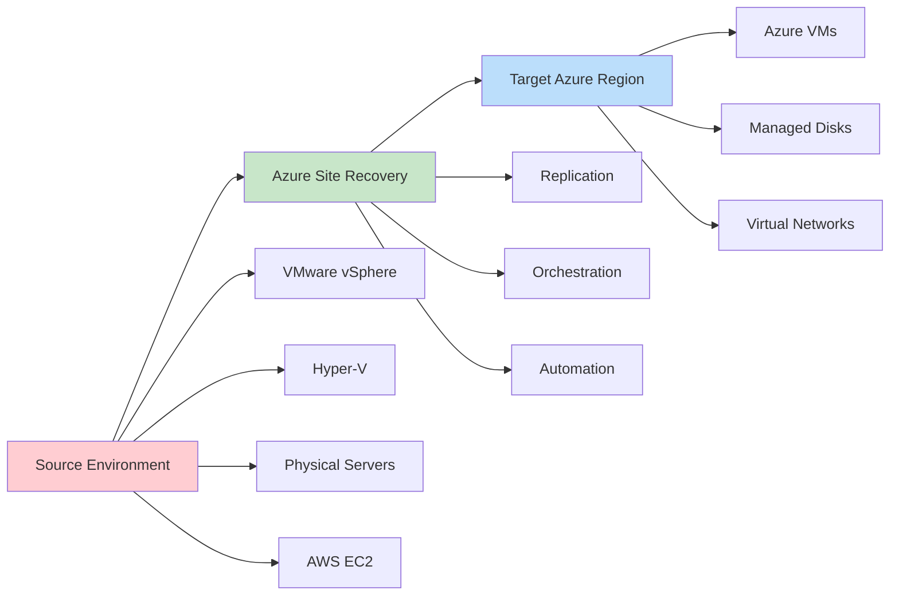
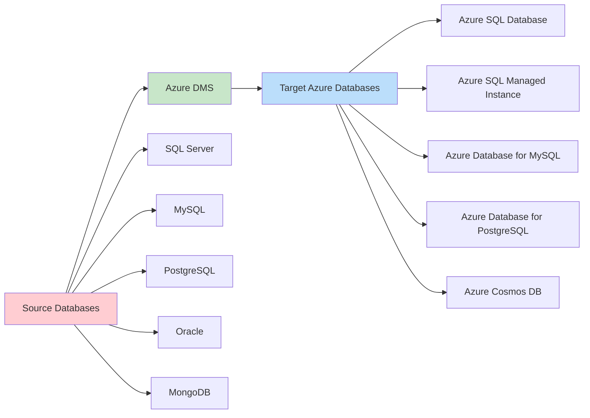

# 🛠️ Migration Tools & Technologies

**Comprehensive guide to Azure migration tools and technologies**

---

## 🎯 Overview

This guide provides detailed information about Azure migration tools, helping you select the right tools for your migration strategy and understand their capabilities, limitations, and best practices.

## 🔍 Tool Categories

### 📊 Migration Tool Ecosystem

```mermaid
flowchart TD
    A[Azure Migration Tools] --> B[Assessment Tools]
    A --> C[Migration Tools]
    A --> D[Optimization Tools]
    A --> E[Management Tools]
    
    B --> B1[Azure Migrate]
    B --> B2[Azure TCO Calculator]
    B --> B3[Service Map]
    B --> B4[Assessment Toolkit]
    
    C --> C1[Azure Site Recovery]
    C --> C2[Database Migration Service]
    C --> C3[Storage Migration Service]
    C --> C4[App Service Migration Assistant]
    
    D --> D1[Azure Advisor]
    D --> D2[Cost Management]
    D --> D3[Monitor]
    D --> D4[Security Center]
    
    E --> E1[Azure Resource Manager]
    E --> E2[Azure DevOps]
    E --> E3[PowerShell/CLI]
    E --> E4[Terraform]
    
    style A fill:#e3f2fd
    style B fill:#c8e6c9
    style C fill:#f8bbd9
    style D fill:#fff3e0
    style E fill:#bbdefb
```



## 🔍 Assessment & Discovery Tools

### 🎯 Azure Migrate

**Primary assessment and migration orchestration platform**

#### **Core Capabilities**

| **Feature** | **Description** | **Supported Scenarios** |
|-------------|----------------|-------------------------|
| 🔍 **Discovery** | Agentless discovery of on-premises workloads | VMware, Hyper-V, Physical servers |
| 📊 **Assessment** | Right-sizing and cost estimation | Performance-based sizing |
| 🚀 **Migration** | Orchestrated migration workflows | Rehost migrations |
| 📈 **Tracking** | Migration progress monitoring | Project management |

#### **Setup & Configuration**

```powershell
# Azure Migrate appliance setup
# Download and deploy the Azure Migrate appliance OVA/VHD

# Register appliance with Azure Migrate project
Connect-AzAccount
Set-AzContext -SubscriptionId "<subscription-id>"

# Create Azure Migrate project
$resourceGroup = "rg-migration-assessment"
$projectName = "contoso-migration-project"
$location = "EastUS"

New-AzResourceGroup -Name $resourceGroup -Location $location

# Create migration project
$project = New-AzMigrateProject -Name $projectName -ResourceGroupName $resourceGroup -Location $location
```

#### **Assessment Configuration**

```json
{
  "assessmentProperties": {
    "azureLocation": "EastUS",
    "pricingTier": "Standard",
    "currency": "USD",
    "discountPercentage": 0,
    "timeRange": "Month",
    "performanceHistory": "Month",
    "percentileUtilization": "95th",
    "comfortFactor": 1.3,
    "sizingCriterion": "PerformanceBased"
  },
  "vmUptime": {
    "daysPerMonth": 31,
    "hoursPerDay": 24
  }
}
```

### 📊 Total Cost of Ownership (TCO) Calculator

**High-level cost estimation for migration planning**

#### **Input Categories**

| **Category** | **Inputs** | **Considerations** |
|--------------|------------|-------------------|
| 🖥️ **Servers** | CPU, RAM, storage, OS | Current utilization patterns |
| 🗄️ **Databases** | Database type, size, IOPS | Performance requirements |
| 💾 **Storage** | Capacity, type, access patterns | Growth projections |
| 🌐 **Networking** | Bandwidth, data transfer | Regional considerations |

#### **Sample TCO Analysis**

```yaml
# TCO Calculator Input Example
servers:
  - name: "Web Servers"
    count: 4
    cpu_cores: 4
    ram_gb: 16
    storage_gb: 500
    os: "Windows Server 2019"
    utilization: 65
    
  - name: "Database Servers"
    count: 2
    cpu_cores: 8
    ram_gb: 32
    storage_gb: 1000
    os: "Windows Server 2019"
    utilization: 80

networking:
  outbound_bandwidth_gbps: 1
  storage_bandwidth_gbps: 0.5

assumptions:
  migration_duration_months: 6
  discount_percentage: 0
  currency: "USD"
  region: "East US"
```

## 🚀 Migration Execution Tools

### 🔄 Azure Site Recovery (ASR)

**Disaster recovery and migration service for VMs**

#### **Migration Scenarios**



#### **ASR Configuration**

```powershell
# Create Recovery Services Vault
$vaultName = "vault-migration-asr"
$resourceGroup = "rg-migration-prod"
$location = "EastUS"

$vault = New-AzRecoveryServicesVault -Name $vaultName -ResourceGroupName $resourceGroup -Location $location

# Set vault context
Set-AzRecoveryServicesVaultContext -Vault $vault

# Create replication policy
$replicationPolicy = New-AzRecoveryServicesAsrPolicy -Name "VMReplicationPolicy" -ReplicationProvider "A2A" -ReplicationFrequencyInSeconds 30 -RecoveryPointRetentionInHours 24 -ApplicationConsistentSnapshotFrequencyInHours 4

# Enable replication for VM
$vm = Get-AzVM -ResourceGroupName "rg-source" -Name "vm-web-01"
$targetResourceGroup = "rg-target"
$targetStorageAccount = "storageaccounttarget"

New-AzRecoveryServicesAsrReplicationProtectedItem -AzureToAzure -AzureVmId $vm.Id -Name "vm-web-01-replication" -ResourceGroupName $targetResourceGroup -PrimaryFabric $primaryFabric -RecoveryFabric $recoveryFabric -Policy $replicationPolicy
```

#### **Migration Process**

| **Phase** | **Action** | **Duration** | **Validation** |
|-----------|------------|--------------|----------------|
| 🔧 **Preparation** | Install agents, configure networking | 1-2 days | Connectivity tests |
| 🔄 **Initial Replication** | Full data copy to Azure | Hours to days | Replication health |
| 🧪 **Test Failover** | Validate migration readiness | 1-2 hours | Application testing |
| ✅ **Cutover** | Final failover and cleanup | 2-4 hours | Production validation |

### 🗄️ Azure Database Migration Service (DMS)

**Managed service for database migrations**

#### **Supported Migration Paths**



#### **DMS Project Configuration**

```json
{
  "dmsProject": {
    "projectName": "contoso-db-migration",
    "sourceType": "SQL",
    "targetType": "SQLMI",
    "location": "EastUS",
    "sourceConnectionInfo": {
      "serverName": "sql-server-onprem.contoso.com",
      "authentication": "SqlAuthentication",
      "userName": "sa",
      "password": "${SQL_PASSWORD}",
      "encryptConnection": true,
      "trustServerCertificate": true
    },
    "targetConnectionInfo": {
      "managedInstanceResourceId": "/subscriptions/{sub-id}/resourceGroups/rg-sql/providers/Microsoft.Sql/managedInstances/sqlmi-contoso",
      "authentication": "SqlAuthentication",
      "userName": "sqladmin",
      "password": "${SQLMI_PASSWORD}"
    }
  }
}
```

#### **Migration Types**

| **Migration Type** | **Downtime** | **Use Case** | **Limitations** |
|-------------------|--------------|--------------|----------------|
| 🔄 **Online** | Minimal (minutes) | Production databases | Size and feature limits |
| 📴 **Offline** | Extended (hours) | Maintenance windows | Full compatibility |
| 🔀 **Hybrid** | Planned downtime | Large databases | Complex setup |

### 💾 Azure Storage Migration Tools

#### **Storage Migration Service (SMS)**

**Windows Server file share migration**

```powershell
# Storage Migration Service PowerShell cmdlets
Install-WindowsFeature -Name SMS-Orchestrator -IncludeManagementTools

# Create migration job
$job = New-SMSJob -Name "FileServerMigration" -OrchestratorComputerName "sms-orchestrator.contoso.com"

# Add source servers
Add-SMSSourceComputer -JobName "FileServerMigration" -ComputerName "fileserver01.contoso.com"

# Inventory source
Start-SMSInventory -JobName "FileServerMigration"

# Transfer data
Start-SMSTransfer -JobName "FileServerMigration"

# Cutover
Start-SMSCutover -JobName "FileServerMigration"
```

#### **Azure File Sync**

**Hybrid file synchronization**

```json
{
  "fileSyncService": {
    "name": "contoso-file-sync",
    "location": "EastUS",
    "storageAccount": "contosofiles",
    "syncGroups": [
      {
        "name": "DepartmentShares",
        "cloudEndpoint": {
          "storageAccount": "contosofiles",
          "fileShare": "department-data"
        },
        "serverEndpoints": [
          {
            "serverName": "fileserver01.contoso.com",
            "path": "D:\\DepartmentShares",
            "cloudTiering": true,
            "volumeFreeSpacePercent": 20
          }
        ]
      }
    ]
  }
}
```

## 📊 Optimization & Management Tools

### 💡 Azure Advisor

**Personalized cloud consultant for optimization recommendations**

#### **Recommendation Categories**

```mermaid
graph TD
    A[Azure Advisor] --> B[Cost]
    A --> C[Security]
    A --> D[Reliability]
    A --> E[Performance]
    A --> F[Operational Excellence]
    
    B --> B1[Right-size VMs]
    B --> B2[Reserved Instances]
    B --> B3[Unused resources]
    
    C --> C1[Enable MFA]
    C --> C2[Network security]
    C --> C3[Identity protection]
    
    D --> D1[Availability Sets]
    D --> D2[Backup configuration]
    D --> D3[Health monitoring]
    
    E --> E1[Storage performance]
    E --> E2[Database optimization]
    E --> E3[Network configuration]
    
    F --> F1[Resource tagging]
    F --> F2[Automation]
    F --> F3[Best practices]
    
    style A fill:#e3f2fd
    style B fill:#c8e6c9
    style C fill:#ffcdd2
    style D fill:#f8bbd9
    style E fill:#fff3e0
    style F fill:#bbdefb
```



#### **Advisor API Integration**

```powershell
# Get Azure Advisor recommendations
$recommendations = Get-AzAdvisorRecommendation -Category Cost

foreach ($rec in $recommendations) {
    Write-Host "Resource: $($rec.ImpactedValue)"
    Write-Host "Impact: $($rec.Impact)"
    Write-Host "Description: $($rec.ShortDescription)"
    Write-Host "Potential Savings: $($rec.ExtendedProperties.savingsAmount)"
    Write-Host "---"
}

# Export recommendations to CSV
$recommendations | Export-Csv -Path "advisor-recommendations.csv" -NoTypeInformation
```

### 💰 Azure Cost Management + Billing

**Cost monitoring and optimization platform**

#### **Cost Management Features**

| **Feature** | **Purpose** | **Implementation** |
|-------------|-------------|--------------------|
| 📊 **Cost Analysis** | Understand spending patterns | Interactive dashboards |
| 💳 **Budgets** | Control spending | Automated alerts |
| 📈 **Recommendations** | Optimization suggestions | Advisor integration |
| 📋 **Exports** | Data analysis | Automated reports |

#### **Budget Configuration**

```json
{
  "budget": {
    "name": "MigrationProjectBudget",
    "amount": 50000,
    "timeGrain": "Monthly",
    "timePeriod": {
      "startDate": "2025-01-01",
      "endDate": "2025-12-31"
    },
    "filters": {
      "resourceGroups": ["rg-migration-prod", "rg-migration-dev"],
      "tags": {
        "Project": ["AzureMigration"]
      }
    },
    "notifications": [
      {
        "enabled": true,
        "operator": "GreaterThan",
        "threshold": 80,
        "contactEmails": ["finance@contoso.com", "cloudops@contoso.com"]
      },
      {
        "enabled": true,
        "operator": "GreaterThan",
        "threshold": 100,
        "contactEmails": ["cto@contoso.com"]
      }
    ]
  }
}
```

## 🔧 Infrastructure as Code (IaC) Tools

### 📋 Azure Resource Manager (ARM) Templates

**Native Azure infrastructure deployment**

#### **Migration ARM Template Example**

```json
{
  "$schema": "https://schema.management.azure.com/schemas/2019-04-01/deploymentTemplate.json#",
  "contentVersion": "1.0.0.0",
  "parameters": {
    "vmName": {
      "type": "string",
      "metadata": {
        "description": "Name of the virtual machine"
      }
    },
    "vmSize": {
      "type": "string",
      "defaultValue": "Standard_D2s_v3",
      "metadata": {
        "description": "Size of the virtual machine"
      }
    }
  },
  "variables": {
    "nicName": "[concat(parameters('vmName'), '-nic')]",
    "subnetRef": "[resourceId('Microsoft.Network/virtualNetworks/subnets', variables('vnetName'), variables('subnetName'))]"
  },
  "resources": [
    {
      "type": "Microsoft.Compute/virtualMachines",
      "apiVersion": "2021-11-01",
      "name": "[parameters('vmName')]",
      "location": "[resourceGroup().location]",
      "properties": {
        "hardwareProfile": {
          "vmSize": "[parameters('vmSize')]"
        },
        "storageProfile": {
          "osDisk": {
            "createOption": "FromImage",
            "managedDisk": {
              "storageAccountType": "Premium_LRS"
            }
          },
          "imageReference": {
            "publisher": "MicrosoftWindowsServer",
            "offer": "WindowsServer",
            "sku": "2022-Datacenter",
            "version": "latest"
          }
        }
      }
    }
  ]
}
```

### 🏗️ Bicep Templates

**Domain-specific language for Azure resource deployment**

```bicep
// Bicep template for migration infrastructure
param location string = resourceGroup().location
param vmName string
param vmSize string = 'Standard_D2s_v3'
param adminUsername string
@secure()
param adminPassword string

// Virtual Network
resource vnet 'Microsoft.Network/virtualNetworks@2021-05-01' = {
  name: '${vmName}-vnet'
  location: location
  properties: {
    addressSpace: {
      addressPrefixes: ['10.0.0.0/16']
    }
    subnets: [
      {
        name: 'default'
        properties: {
          addressPrefix: '10.0.1.0/24'
        }
      }
    ]
  }
}

// Network Interface
resource nic 'Microsoft.Network/networkInterfaces@2021-05-01' = {
  name: '${vmName}-nic'
  location: location
  properties: {
    ipConfigurations: [
      {
        name: 'ipconfig1'
        properties: {
          subnet: {
            id: vnet.properties.subnets[0].id
          }
          privateIPAllocationMethod: 'Dynamic'
        }
      }
    ]
  }
}

// Virtual Machine
resource vm 'Microsoft.Compute/virtualMachines@2021-11-01' = {
  name: vmName
  location: location
  properties: {
    hardwareProfile: {
      vmSize: vmSize
    }
    osProfile: {
      computerName: vmName
      adminUsername: adminUsername
      adminPassword: adminPassword
    }
    storageProfile: {
      osDisk: {
        createOption: 'FromImage'
        managedDisk: {
          storageAccountType: 'Premium_LRS'
        }
      }
      imageReference: {
        publisher: 'MicrosoftWindowsServer'
        offer: 'WindowsServer'
        sku: '2022-Datacenter'
        version: 'latest'
      }
    }
    networkProfile: {
      networkInterfaces: [
        {
          id: nic.id
        }
      ]
    }
  }
}

output vmId string = vm.id
output vmName string = vm.name
```

### 🌍 Terraform

**Multi-cloud infrastructure as code**

```hcl
# Terraform configuration for Azure migration
terraform {
  required_providers {
    azurerm = {
      source  = "hashicorp/azurerm"
      version = "~>3.0"
    }
  }
}

provider "azurerm" {
  features {}
}

# Resource Group
resource "azurerm_resource_group" "migration" {
  name     = "rg-migration-${var.environment}"
  location = var.location
  
  tags = {
    Environment = var.environment
    Project     = "AzureMigration"
    Owner       = var.owner
  }
}

# Virtual Network
resource "azurerm_virtual_network" "migration" {
  name                = "vnet-migration-${var.environment}"
  address_space       = ["10.0.0.0/16"]
  location            = azurerm_resource_group.migration.location
  resource_group_name = azurerm_resource_group.migration.name
  
  tags = azurerm_resource_group.migration.tags
}

# Subnet
resource "azurerm_subnet" "web" {
  name                 = "subnet-web"
  resource_group_name  = azurerm_resource_group.migration.name
  virtual_network_name = azurerm_virtual_network.migration.name
  address_prefixes     = ["10.0.1.0/24"]
}

# Network Security Group
resource "azurerm_network_security_group" "web" {
  name                = "nsg-web-${var.environment}"
  location            = azurerm_resource_group.migration.location
  resource_group_name = azurerm_resource_group.migration.name

  security_rule {
    name                       = "HTTP"
    priority                   = 1001
    direction                  = "Inbound"
    access                     = "Allow"
    protocol                   = "Tcp"
    source_port_range          = "*"
    destination_port_range     = "80"
    source_address_prefix      = "*"
    destination_address_prefix = "*"
  }
  
  tags = azurerm_resource_group.migration.tags
}

# Variables
variable "environment" {
  description = "Environment name"
  type        = string
  default     = "prod"
}

variable "location" {
  description = "Azure region"
  type        = string
  default     = "East US"
}

variable "owner" {
  description = "Resource owner"
  type        = string
}

# Outputs
output "resource_group_name" {
  value = azurerm_resource_group.migration.name
}

output "virtual_network_id" {
  value = azurerm_virtual_network.migration.id
}
```

## 📊 Tool Selection Matrix

### 🎯 Tool Selection Criteria

| **Scenario** | **Primary Tool** | **Supporting Tools** | **Complexity** |
|--------------|------------------|---------------------|----------------|
| 🔍 **Assessment Only** | Azure Migrate | TCO Calculator, Service Map | Low |
| 🚀 **VM Migration** | Azure Site Recovery | Azure Migrate, Storage Migration | Medium |
| 🗄️ **Database Migration** | Database Migration Service | Azure Migrate, SQL Migration Assistant | Medium |
| 📁 **File Migration** | Storage Migration Service | Azure File Sync, AzCopy | Low |
| 🏗️ **App Modernization** | Azure DevOps | App Service Migration Assistant, Container Registry | High |
| 🌍 **Hybrid Setup** | Azure Arc | Azure Monitor, Policy | High |

### 📈 Tool Comparison Matrix

| **Tool** | **Complexity** | **Cost** | **Learning Curve** | **Best For** |
|----------|----------------|----------|-------------------|--------------|
| 🔍 **Azure Migrate** | Low | Free | Low | Initial assessment |
| 🔄 **Azure Site Recovery** | Medium | Pay-per-use | Medium | VM migration |
| 🗄️ **Database Migration Service** | Medium | Free | Medium | Database migration |
| 🏗️ **Azure DevOps** | High | Tiered pricing | High | CI/CD and app deployment |
| 🌍 **Terraform** | High | Free (OSS) | High | Multi-cloud IaC |

## 📚 Best Practices & Recommendations

### ✅ Tool Selection Guidelines

#### **Assessment Phase**
1. **🎯 Start with Azure Migrate** for comprehensive discovery
2. **💰 Use TCO Calculator** for high-level cost estimates
3. **📊 Leverage Service Map** for dependency mapping
4. **🔍 Run assessments regularly** to track changes

#### **Migration Phase**
1. **🚀 Use Azure Site Recovery** for VM migrations
2. **🗄️ Choose DMS** for database migrations
3. **📁 Implement SMS** for file share migrations
4. **🔄 Plan for parallel migrations** where possible

#### **Optimization Phase**
1. **💡 Monitor Azure Advisor** recommendations
2. **💰 Set up Cost Management** budgets and alerts
3. **📊 Use Azure Monitor** for performance tracking
4. **🔧 Implement IaC** for consistent deployments

### 🎓 Training & Certification

#### **Recommended Certifications**

| **Role** | **Certification** | **Focus Areas** |
|----------|------------------|----------------|
| 🏗️ **Architect** | Azure Solutions Architect Expert | Overall strategy and design |
| 👨‍💻 **Engineer** | Azure Administrator Associate | Implementation and management |
| 🗄️ **DBA** | Azure Database Administrator Associate | Database migration and optimization |
| 🔒 **Security** | Azure Security Engineer Associate | Security and compliance |

---

### 🔗 Related Resources

- 📖 [Assessment Tools Guide](assessment-tools.md)
- 🚀 [Implementation Guides](../02-rehost/implementation.md)
- 💰 [Cost Optimization Strategies](../04-frameworks/waf-alignment.md#cost-optimization)
- 🛡️ [Security Best Practices](../04-frameworks/waf-alignment.md#security)
- [Azure VM Baseline Landing Zone](../azure-vm-baseline-landing-zone.md)
- [Azure Migration GitHub Repository](../azure-migration-github-repo.md)

---

**📅 Last Updated**: May 2025  
**👥 Contributors**: Cloud Engineering & Tools Team  
**🔄 Review Cycle**: Monthly (tools evolve rapidly)
