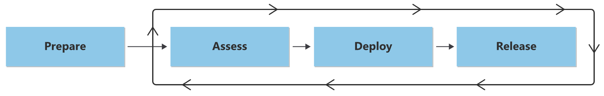

# Migration Resources: Business Guide

## 🧰 Essential Resources for Successful Azure Migration

This guide provides a business-focused overview of key resources that accelerate and simplify Azure migration. These resources help organizations reduce risk, follow best practices, and achieve successful outcomes with less effort.

> **Executive Insight**: *"Pre-built migration resources can reduce your implementation timeline by up to 60% and significantly increase your success rate by leveraging proven patterns and practices."*

---

## 🏗️ Azure VM Baseline Landing Zone

The VM Baseline Landing Zone is a production-ready environment that provides a secure foundation for hosting virtual machines in Azure.

### Business Benefits

| Benefit | Metrics | Business Impact |
|---------|---------|----------------|
| **Accelerated Deployment** | 75% faster environment setup | Reduced time-to-value for migration initiatives |
| **Built-in Security** | 80% of security controls pre-configured | Lower security and compliance risks |
| **Operational Consistency** | Standardized environment across projects | Easier management and reduced operational overhead |
| **Cost Governance** | Pre-configured cost controls and monitoring | Better budget predictability and optimization |

### Key Components

| Component | Purpose | Business Value |
|-----------|---------|---------------|
| **Subscription Design** | Proper organizational structure | Simplified billing and access management |
| **Network Architecture** | Secure connectivity design | Protected cloud resources with proper isolation |
| **Identity & Access** | Integrated identity management | Streamlined security administration |
| **Policy Framework** | Governance guardrails | Automated compliance and risk reduction |
| **Management Baseline** | Monitoring and operations setup | Improved visibility and operational efficiency |

### When to Use

- **New to Azure**: Organizations setting up their first Azure environment
- **Datacenter Migration**: Projects moving multiple workloads to Azure
- **Security Focus**: When security and compliance are top priorities
- **Multi-Region**: Deployments spanning multiple geographies

> **Customer Example**: *"A healthcare provider deployed the VM Baseline Landing Zone in just 3 days, compared to their estimated 3-week custom build. This allowed them to begin migration 2 weeks earlier than planned while ensuring all security and compliance requirements were met."*

---

## 📚 Migration Execution Guide (MEG)

The Migration Execution Guide (MEG) is a comprehensive collection of templates, scripts, and guidance that streamlines the entire migration lifecycle.

### Business Benefits

| Benefit | Metrics | Business Impact |
|---------|---------|----------------|
| **Accelerated Delivery** | 40% faster project completion | Earlier realization of cloud benefits |
| **Reduced Risk** | 50% fewer migration issues | Less business disruption during transition |
| **Standardization** | Consistent approach across projects | Better predictability and governance |
| **Knowledge Transfer** | Built-in best practices | Less reliance on external expertise over time |

### Key Components

| Component | Purpose | Business Value |
|-----------|---------|---------------|
| **Assessment Templates** | Application discovery tools | Comprehensive visibility into migration scope |
| **Architecture Patterns** | Pre-designed solution templates | Proven designs that reduce architectural risk |
| **Migration Runbooks** | Step-by-step implementation guides | Detailed playbooks that reduce execution errors |
| **Automation Scripts** | Ready-to-use automation | Faster, more consistent deployments |
| **Testing Frameworks** | Validation approach and tools | Thorough verification with less effort |

### When to Use

- **Large-Scale Migration**: Projects involving multiple applications or systems
- **Tight Timelines**: When rapid implementation is required
- **Limited Experience**: Teams new to Azure migration
- **Complex Dependencies**: Applications with many interconnected components

> **Customer Example**: *"A manufacturing company with over 200 applications used MEG to create a repeatable migration factory approach. They achieved 30% faster migrations with 45% fewer post-migration issues compared to their initial pilot projects."*

---

## 🔄 Azure Migration Program (AMP)

The Azure Migration Program provides expert guidance, tools, and incentives to accelerate your journey to Azure.

### Business Benefits

| Benefit | Metrics | Business Impact |
|---------|---------|----------------|
| **Financial Incentives** | Cost offset for migration | Improved project ROI and lower barriers to entry |
| **Expert Guidance** | Direct access to Microsoft experts | Reduced technical risk through specialized knowledge |
| **Tailored Resources** | Customized tools and assessment | Solutions aligned to your specific business needs |
| **Skill Development** | Knowledge transfer to your team | Enhanced internal capabilities for ongoing success |

### Program Components

| Component | Description | Business Value |
|-----------|-------------|---------------|
| **Migration Planning** | Customized migration roadmap | Strategic alignment with business objectives |
| **Technical Skilling** | Training and enablement | Improved team capabilities and confidence |
| **Implementation Support** | Expert assistance during execution | Rapid issue resolution and risk mitigation |
| **Partner Ecosystem** | Access to qualified partners | Specialized expertise when needed |

### When to Consider

- **Strategic Migrations**: Cloud initiatives with C-level visibility
- **Complex Environments**: Heterogeneous or legacy environments
- **Skill Gaps**: Limited internal Azure expertise
- **Cost Sensitivity**: When financial incentives would accelerate approval

> **Pro Tip**: *"AMP participants typically see 40% faster cloud adoption and 50% higher satisfaction with their migration outcomes compared to organizations migrating without program support."*

---

## 📊 Case Studies & Success Stories

Learning from others' experiences can provide valuable insights for your own migration journey.

### Manufacturing

**Company**: Global automotive parts manufacturer  
**Challenge**: Aging infrastructure with frequent outages affecting production  
**Approach**: Rehosted 150+ VMs to Azure using VM Baseline Landing Zone  
**Results**:
- 99.99% availability (up from 98.5%)
- 42% reduction in infrastructure costs
- 60% faster deployment of new manufacturing systems

### Financial Services

**Company**: Regional bank with 50+ branches  
**Challenge**: Regulatory compliance concerns and scalability limitations  
**Approach**: Refactored core banking applications using MEG templates  
**Results**:
- Achieved compliance with all regulatory requirements
- 35% improvement in transaction processing speed
- 28% reduction in total cost of ownership

### Healthcare

**Company**: National healthcare provider network  
**Challenge**: Patient data accessibility while maintaining strict security  
**Approach**: Hybrid migration with AMP support for sensitive systems  
**Results**:
- Zero security incidents during or after migration
- 65% faster access to patient records
- $3.2M annual savings in operational costs

### Retail

**Company**: E-commerce retailer with seasonal demand spikes  
**Challenge**: Unable to scale for holiday shopping seasons  
**Approach**: Refactored customer-facing systems, rehosted back-office  
**Results**:
- 300% better handling of peak traffic periods
- 52% reduction in cart abandonment rate
- 47% faster development of new features

---

## 📌 Resource Selection Guide

Use this decision tree to determine which resources are most valuable for your specific migration scenario:

1. **What is your timeline?**
   - **Urgent (< 3 months)**:
     - VM Baseline Landing Zone
     - MEG Migration Scripts
   - **Standard (3-6 months)**:
     - Complete MEG Implementation
     - Azure Migration Program
   - **Strategic (6+ months)**:
     - Custom Landing Zone
     - Full Architectural Review

2. **What is your experience level?**
   - **New to Azure**:
     - Azure Migration Program
     - VM Baseline Landing Zone
   - **Some Azure Experience**:
     - MEG Templates
     - Selective AMP Components
   - **Azure Experts**:
     - Advanced MEG Components
     - Custom Modifications

3. **What is your migration scope?**
   - **Small (< 50 VMs)**:
     - Basic Landing Zone
     - Selected MEG Templates
   - **Medium (50-200 VMs)**:
     - Full VM Baseline Landing Zone
     - Complete MEG Implementation
   - **Large (200+ VMs)**:
     - Azure Migration Program
     - Enterprise-scale Landing Zone
     - Migration Factory Approach

> **Final Thought**: *"The most successful migrations combine these resources strategically based on your specific business objectives, timeline constraints, and organizational capabilities. Don't hesitate to mix and match components to create your optimal approach."*
