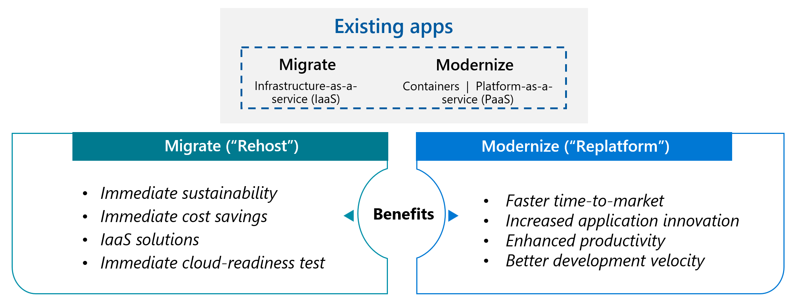

# Migration Strategies: Business Guide

## 📋 Strategy Overview: Choosing Your Path to the Cloud

Selecting the right migration strategy is critical to meeting your business objectives while minimizing risk and disruption. This guide provides a business-focused overview of the two primary migration strategies: Rehost and Refactor.

> **Executive Insight**: *"The fastest path to the cloud isn't always the best for your business goals. Choose your migration strategy based on your specific business outcomes, timeline constraints, and application characteristics."*

---

## 🚚 Rehost: Lift and Shift

Rehosting moves your existing systems to Azure with minimal changes—often called "lift and shift." This approach prioritizes speed and risk reduction over cloud optimization.

### Business Benefits

| Benefit | Metrics | Business Impact |
|---------|---------|----------------|
| **Speed to Market** | 30-50% faster migration | Quicker realization of basic cloud benefits like exit from datacenter |
| **Risk Reduction** | 60% fewer migration issues | Lower business disruption during migration |
| **Cost Efficiency** | 20-30% infrastructure savings | Immediate reduction in capital expenses |
| **Minimal Retraining** | Near-zero learning curve | Existing staff can manage systems without extensive retraining |

### Ideal Business Scenarios

- **Datacenter Exit**: When you need to vacate a physical datacenter quickly
- **Capital Expense Reduction**: When you need to eliminate hardware refresh cycles
- **Low-Risk First Steps**: For organizations new to cloud adoption
- **Legacy Systems**: For applications that function well but need cloud infrastructure benefits

### Implementation Timeline

| Phase | Duration | Key Activities | Business Deliverables |
|-------|----------|---------------|----------------------|
| **Assessment** | 1-2 weeks | • Inventory systems • Compatibility checking | ✓ Migration candidate list ✓ Sizing requirements |
| **Planning** | 1-3 weeks | • Resource planning • Network design • Security mapping | ✓ Target architecture ✓ Migration plan ✓ Cost projections |
| **Migration** | 2-8 weeks | • VM replication • Test migrations • Cutover planning | ✓ Working cloud environment ✓ Validated applications |
| **Optimization** | Ongoing | • Performance tuning • Cost optimization | ✓ Optimized cloud spend ✓ Performance baselines |

> **Real-World Example**: *"A financial services company migrated 1,200 VMs to Azure using a rehost strategy, completing their datacenter exit 4 months ahead of schedule and reducing infrastructure costs by 28% in the first year."*

---

## 🔄 Refactor: Modernize Key Components

Refactoring involves making targeted changes to your applications to better leverage cloud capabilities, without completely rebuilding them. This approach balances modernization benefits with pragmatic implementation timelines.

### Business Benefits

| Benefit | Metrics | Business Impact |
|---------|---------|----------------|
| **Cost Optimization** | 30-50% operational savings | Better utilization of cloud-native services reduces ongoing costs |
| **Improved Scalability** | 200-300% better peak handling | Better customer experience during high-demand periods |
| **Enhanced Reliability** | 99.95%+ availability | Fewer outages and business disruptions |
| **Operational Efficiency** | 40% less management overhead | IT teams spend less time on maintenance, more on innovation |

### Ideal Business Scenarios

- **Performance Bottlenecks**: When current system performance is limiting business growth
- **Cost Challenges**: When operating costs for current systems are too high
- **Competitive Pressure**: When you need to improve customer experience or time-to-market
- **Modernization Steps**: When taking an incremental approach to full application modernization

### Implementation Timeline

| Phase | Duration | Key Activities | Business Deliverables |
|-------|----------|---------------|----------------------|
| **Assessment** | 2-3 weeks | • Application analysis • Dependency mapping • Modernization opportunities | ✓ Refactoring targets ✓ Expected business outcomes |
| **Planning** | 2-4 weeks | • Target architecture • Service selection • Refactoring scope | ✓ Detailed refactoring plan ✓ Risk mitigation strategy |
| **Implementation** | 4-12 weeks | • Code modifications • Service integration • Testing | ✓ Modernized application components ✓ Improved capabilities |
| **Optimization** | Ongoing | • Performance monitoring • Further refactoring | ✓ Continuous improvement ✓ Increasing cloud ROI |

> **Real-World Example**: *"A retail company refactored their e-commerce platform's database tier to Azure SQL and caching layer to Azure Redis Cache, resulting in 45% faster page load times and a 23% increase in conversion rates during their seasonal sales events."*

---

## 🔍 Strategy Comparison: Making the Right Choice

| Consideration | Rehost | Refactor |
|---------------|--------|----------|
| **Time to Value** | ⭐⭐⭐⭐⭐ Fastest option | ⭐⭐⭐ Requires some development time |
| **Risk Level** | ⭐ Lowest risk option | ⭐⭐ Moderate risk with proper testing |
| **Cost Savings** | ⭐⭐ Initial savings, but less optimized | ⭐⭐⭐⭐ Better long-term economics |
| **Cloud Benefits** | ⭐⭐ Basic infrastructure benefits | ⭐⭐⭐⭐ Leverages more cloud capabilities |
| **Operational Change** | ⭐ Minimal process changes | ⭐⭐⭐ Requires some operational adjustments |
| **Future Flexibility** | ⭐⭐ Limited optimization potential | ⭐⭐⭐⭐ Better foundation for future innovation |

### Decision Framework

Ask these questions to determine which strategy best fits your business needs:

1. **Timeline Pressure**: How quickly do you need to be in the cloud?
   - *Immediate need* → Rehost
   - *Can invest some time* → Refactor

2. **Application Criticality**: How important is the application to your business?
   - *Supporting systems* → Often Rehost
   - *Core business applications* → Consider Refactor

3. **Current Performance**: Are you experiencing issues with the current system?
   - *Performs adequately* → Rehost may suffice
   - *Performance problems* → Refactor likely needed

4. **Resource Availability**: Do you have development resources available?
   - *Limited development capacity* → Rehost
   - *Development team available* → Refactor is viable

5. **Business Growth**: Are you anticipating significant business growth?
   - *Stable business needs* → Rehost may be adequate
   - *Growth or variability expected* → Refactor for scalability

> **Pro Tip**: *"Many successful cloud migrations use a hybrid approach, rehosting some applications while refactoring the most critical or problematic components to maximize ROI."*

---

## 📈 Measuring Success: Key Business Metrics

| Metric Category | Rehost Metrics | Refactor Metrics | Target Improvement |
|----------------|---------------|-----------------|-------------------|
| **Cost** | • Infrastructure cost reduction • CAPEX to OPEX shift | • Total cost of ownership • Resource utilization efficiency | 20-40% reduction |
| **Performance** | • System availability • Basic response times | • Application throughput • End-user experience metrics | 15-45% improvement |
| **Agility** | • Provisioning time reduction • Deployment frequency | • Feature delivery time • Business process improvement | 30-60% faster |
| **Risk** | • Successful DR tests • Security compliance | • Reduced technical debt • Automated recovery | 50-70% risk reduction |

## 🔄 Next Steps

1. **Conduct Application Assessment**:
   - Inventory all applications and infrastructure
   - Score applications on business value and modernization complexity
   - Identify initial candidates for each strategy

2. **Build Your Business Case**:
   - Calculate expected TCO for each approach
   - Define clear success metrics aligned with business goals
   - Set realistic timelines and resource requirements

3. **Create a Phased Approach**:
   - Start with lower-risk applications to build experience
   - Plan waves that group similar applications or dependencies
   - Build a feedback loop to apply learnings to subsequent waves

> **Executive Decision Point**: Consider starting with a rehosting approach for non-critical systems while refactoring your most important business applications in parallel. This balanced approach delivers quick wins while building toward optimal long-term solutions.
