# 🚀 Migration Execution Guide (MEG)

**A practical toolkit for accelerating and automating your Azure migration journey**

---

## 📦 What is the Migration Execution Guide (MEG)?

The [Migration Execution Guide (MEG) GitHub repository](https://github.com/Azure/migration) is an open-source collection of tools, scripts, templates, and guidance designed to help organizations plan, execute, and optimize migrations to Microsoft Azure. It is maintained by Microsoft and the Azure community, and is regularly updated with new resources and best practices.

---

## 🎯 Key Features & Contents

- **Automation scripts** for common migration tasks (e.g., VM discovery, assessment, and migration)
- **Reference architectures** and templates for rehost, refactor, and hybrid strategies
- **Sample code** for integrating with Azure Migrate, Azure Site Recovery, and other migration tools
- **Step-by-step guides** for end-to-end migration scenarios
- **Issue tracking and community Q&A** for troubleshooting and support

---

## 🛠️ Typical Use Cases

- **Accelerate migration projects** with ready-to-use automation and templates
- **Customize migration workflows** to fit unique business or technical requirements
- **Integrate with CI/CD pipelines** for repeatable, reliable migrations
- **Learn from real-world examples** contributed by Microsoft and the community

---

## 🔗 Integration Guidance

- **Start with the [README](https://github.com/Azure/migration#readme)** for an overview and quickstart instructions
- **Clone or fork the repository** to adapt scripts and templates for your environment
- **Leverage reference architectures** to align with Cloud Adoption Framework (CAF) and Well-Architected Framework (WAF) principles
- **Contribute improvements** or report issues to help the community

---

## 🗺️ How It Fits in Your Migration Journey

```mermaid
---
title: Migration Execution Guide (MEG) in the Migration Journey
---
flowchart LR
    A[🏢 On-Premises Environment] --> B[🔍 Assessment & Planning]
    B --> C[🛠️ Use MEG]
    C --> D[🚚 Migration Execution]
    D --> E[🔄 Post-Migration Optimization]
    style C fill:#e3f2fd,stroke:#1976d2,stroke-width:2px
```

- **Assessment & Planning:** Use scripts and templates to inventory and assess workloads
- **Migration Execution:** Automate rehost/refactor tasks and integrate with Azure Migrate
- **Optimization:** Apply best practices and reference architectures for ongoing improvements

---

## 📚 References & Further Reading

- [Migration Execution Guide (MEG) GitHub Repository](https://github.com/Azure/migration)
- [Azure Migrate Documentation](https://learn.microsoft.com/en-us/azure/migrate/)
- [Cloud Adoption Framework](https://learn.microsoft.com/en-us/azure/cloud-adoption-framework/)
- [Well-Architected Framework](https://learn.microsoft.com/en-us/azure/well-architected/)

---

**Return to:** [Migration Tools](./05-tools/migration-tools.md) | [Strategy Selection](./01-getting-started/strategy-selection.md) | [Quick Guides Home](./quick-guides/index.md)
