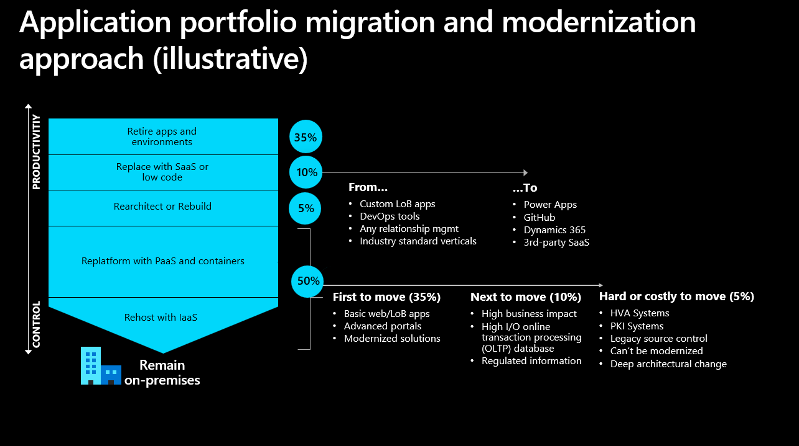

# Migration Essentials: Business Guide

## 🚀 Why Cloud Migration Matters: The Business Case

Cloud migration is a strategic business decision that delivers significant benefits when executed properly:

- **Financial Benefits**:
  - Convert capital expenses (CAPEX) to operational expenses (OPEX)
  - 30-40% average reduction in total cost of ownership (TCO)
  - Pay-as-you-go pricing aligns costs with actual usage

- **Operational Benefits**:
  - 99.99% uptime SLAs for critical services
  - Built-in disaster recovery capabilities
  - Automatic scaling to handle peak demand periods

- **Strategic Benefits**:
  - 3-6 months faster time-to-market for new initiatives
  - Focus IT resources on innovation rather than maintenance
  - 70% reduction in procurement cycles for new capabilities

> **Executive Insight**: *"Cloud migration isn't just an IT initiative—it's a business transformation that improves agility, reduces costs, and enables innovation at scale."*

---

## 🏗️ Essential Frameworks for Success

### Cloud Adoption Framework (CAF)

The Microsoft Cloud Adoption Framework provides a proven structure for the cloud journey:

| CAF Phase | Business Focus | Key Deliverables |
|-----------|---------------|------------------|
| **Strategy** | Define business justification & outcomes | ✓ Business case ✓ ROI calculation ✓ First adoption project |
| **Plan** | Align technical & business plans | ✓ Digital estate rationalization ✓ Skills readiness plan ✓ Migration backlog |
| **Ready** | Prepare cloud environment | ✓ Landing zone deployment ✓ Cloud governance model ✓ Cloud operations model |
| **Adopt** | Implement cloud solutions | ✓ Workload migrations ✓ Cloud innovation projects ✓ Business value measurement |
| **Govern** | Control & protect environment | ✓ Cost management policies ✓ Security baselines ✓ Resource consistency |
| **Manage** | Operate at scale | ✓ Service level alignment ✓ Operational compliance ✓ Business continuity |

**Business Value**: The CAF reduces migration risks by up to 65% and accelerates cloud adoption by following proven methodologies.

### Well-Architected Framework (WAF)

The Well-Architected Framework ensures your migrated solutions are built on solid foundations:

| WAF Pillar | Business Significance | Example Benefits |
|------------|----------------------|------------------|
| **Cost Optimization** | Maximize ROI | - 25-40% infrastructure savings - Budget predictability - Transparent cost allocation |
| **Reliability** | Business continuity | - 99.99% availability for critical apps - Automatic recovery from failures - Reduced customer impact during issues |
| **Security** | Protect business assets | - Advanced threat protection - Up to 75% reduction in security incidents - Improved compliance posture |
| **Operational Excellence** | Efficient management | - 40% reduction in support tickets - Faster resolution times - More predictable operations |
| **Performance Efficiency** | Optimal user experience | - Improved application responsiveness - Consistent performance at scale - Better user satisfaction metrics |

**Business Value**: Organizations that follow WAF principles see a 66% reduction in service outages and 45% lower support costs.

---

## 🛠️ Essential Tools for Migration Success

### Assessment & Planning Tools

| Tool | Purpose | When to Use | Business Benefit |
|------|---------|-------------|-----------------|
| **Azure Migrate** | Discover, assess, and migrate | Early planning stages | - Accurate sizing recommendations - 30-40% cost savings through right-sizing |
| **Total Cost of Ownership Calculator** | Financial planning | Building business case | - Demonstrate projected cost savings - Compare on-premises vs. Azure costs |
| **Service Map** | Visualize dependencies | Application planning | - Identify critical dependencies - Avoid costly migration issues |
| **Strategy Assessor** | Evaluate strategy fit | Solution planning | - Find optimal migration path - Reduce migration risks |

**Business Value**: Using assessment tools reduces the average migration project's timeline by 30% and improves success rates by 45%.

### Migration Execution Tools

| Tool | Purpose | When to Use | Business Benefit |
|------|---------|-------------|-----------------|
| **Azure Site Recovery** | VM migration | Rehost scenarios | - Minimize downtime to minutes - Simplified migration testing |
| **Azure Database Migration Service** | Database migration | Data tier migration | - Minimal disruption to operations - Automated schema conversion |
| **Azure App Service Migration Assistant** | Website migration | Web application migration | - Automated compatibility assessment - Guided migration process |
| **Azure DevOps** | Migration orchestration | Throughout process | - Improved team coordination - Migration workflow automation |

**Business Value**: Organizations using Microsoft's migration tools report 43% fewer rollbacks and 38% shorter project timelines.

---

## 📊 Migration Readiness Checklist for Business Leaders

Use this checklist to ensure your organization is prepared for cloud migration:

- **Business Strategy**
  - [ ] Clear business objectives defined for migration
  - [ ] Executive sponsor identified and engaged
  - [ ] Success metrics established (financial, operational, strategic)
  - [ ] Budget allocated for migration and post-migration optimization

- **Team Readiness**
  - [ ] Migration roles and responsibilities assigned
  - [ ] Skill gaps identified and addressed through training or partners
  - [ ] Communication plan established for stakeholders
  - [ ] Change management process defined

- **Compliance & Governance**
  - [ ] Regulatory requirements identified
  - [ ] Data residency needs addressed
  - [ ] Security and compliance controls defined
  - [ ] Cloud governance model established

> **Pro Tip**: Consider using the [Azure Migration Program (AMP)](https://azure.microsoft.com/migration/migration-program/) for access to free tools, resources, and expert guidance.

---

## 🔄 Migration Project Timeline

| Phase | Duration | Key Activities | Business Outcomes |
|-------|----------|---------------|-------------------|
| **Discovery & Assessment** | 2-4 weeks | • Inventory current environment • Analyze dependencies • Assess readiness | ✓ Comprehensive migration plan ✓ Accurate cost projections ✓ Risk mitigation strategies |
| **Planning & Preparation** | 3-6 weeks | • Design target architecture • Build landing zones • Define governance model | ✓ Secure, compliant foundation ✓ Clear migration roadmap ✓ Team alignment & readiness |
| **Migration Execution** | 4-12 weeks | • Migrate workloads in waves • Validate functionality • Optimize first workloads | ✓ Initial workloads in Azure ✓ Proven migration patterns ✓ Early business value demonstration |
| **Optimization & Scale** | Ongoing | • Optimize costs & performance • Expand migrated workloads • Apply lessons learned | ✓ Maximum ROI achievement ✓ Operational efficiencies ✓ Foundation for innovation |

**Business Value**: Following a structured timeline reduces migration costs by 25-35% and improves stakeholder satisfaction by clearly communicating expectations.

---

## 🎯 Next Steps: Getting Started with Your Cloud Journey

1. **Set Your Strategy**:
   - Define clear business outcomes and success metrics
   - Conduct a high-level assessment of your IT estate
   - Identify initial candidate workloads for migration

2. **Build Your Team**:
   - Identify key stakeholders across IT and business units
   - Assess existing cloud skills and identify training needs
   - Consider engaging a Microsoft partner for expertise

3. **Create Your Plan**:
   - Build a comprehensive business case with TCO analysis
   - Develop a phased migration approach
   - Establish governance and security foundations

> **Expert Tip**: "Start with a small, non-critical workload to gain migration experience and build confidence before tackling more complex systems."
